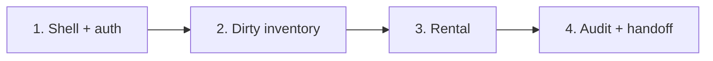

# Hardware Hub Five-Hour Roadmap

## Delivery Principle

Ship a complete vertical product and make the malformed seed the centerpiece of
the engineering story. Architecture exists only to keep the code understandable
for four small pull requests; explicit shortcuts are preferable to unfinished
infrastructure.

The executable plan lives in
[`docs/superpowers/plans/2026-07-22-hardware-hub-roadmap.md`](docs/superpowers/plans/2026-07-22-hardware-hub-roadmap.md).

## Artifacts

- [Slice 1 shell/auth specification](docs/superpowers/specs/2026-07-22-slice-1-shell-auth-design.md) — approved functional and visual contract for the first PR.
- [Reference UI mockup](docs/assets/hardware-hub-reference-ui.png) — visual
  direction for Slice 1's shell and Slice 2's dashboard/admin screens. It is a
  styling and layout reference, not an expansion of the MVP feature scope.

## Pull Request Sequence

| Slice | Branch | Target | Reviewable outcome | Status |
| --- | --- | ---: | --- | --- |
| 1 | `codex/01-shell-auth` | 80m | Runnable app, visual foundation, signed-cookie login, admin-created users, health check, and minimal CI | Not started |
| 2 | `codex/02-dirty-inventory` | 90m | All eleven records preserved, anomalies visible, dashboard working, and admin CRUD complete | Blocked on Slice 1 merge |
| 3 | `codex/03-rental` | 55m | Guarded rent/return flow with ownership and visible history | Blocked on Slice 2 merge |
| 4 | `codex/04-audit-release` | 75m | Deterministic/LLM audit, honest documentation, manual smoke verification, and Railway-ready configuration | Blocked on Slice 3 merge |

The targets total five implementation hours. User review, CI queueing, dependency
downloads, and Railway provisioning latency are outside that clock. When a target
is threatened, reduce visual polish, HTMX enhancement, or abstraction—not the
working login, dirty-data evidence, rental flow, deterministic fallback, or
deployability.



## Mandatory Slice Workflow

Each slice still uses sub-agents, but orchestration must not become its own
project:

1. Start the branch from reviewed and merged `main`.
2. Give at least one implementation sub-agent a bounded feature or test task.
3. Use a fresh read-only sub-agent for one specification/quality review.
4. Parallelize only clearly disjoint files; the root agent owns integration.
5. Run the minimal gate, perform the slice's manual smoke check, and open one PR
   with a small Mermaid DAG.
6. Stop for user review before starting the next branch.

Sub-agents do not commit, push, or open PRs from the shared worktree.

## Minimal CI

One Ubuntu job runs on pull requests and pushes to `main`:

```text
uv sync --locked
uv run ruff format --check .
uv run ruff check .
uv run pytest -q
```

There is no matrix, coverage service, mypy job, package-build job, Playwright,
preview environment, or deployment automation.

## Five Automated Tests That Matter

1. An admin creates a user; both can log in, while the ordinary user is denied an
   admin mutation.
2. All eleven source records survive idempotent loading; both duplicate IDs and
   the exact deterministic findings remain visible.
3. Canonical admin correction of source `10` clears its three repairable findings
   without rewriting the preserved raw source; unauthorized writes fail.
4. One unsafe item is blocked; a safe item completes the owner-only rent/return
   journey with history.
5. One LLM provider failure leaves deterministic audit results and inventory
   intact.

Tests can contain several assertions around one behavior. The goal is evidence,
not test-count inflation.

## Definition of Done

- The slice provides its advertised browser-visible behavior end to end.
- The relevant automated test passes, along with the complete small suite.
- Desktop and narrow-width manual smoke checks pass for changed screens.
- README and AI-development notes record actual shortcuts and corrections.
- The PR describes what works, what was deliberately omitted, validation, and a
  small dependency/data-flow DAG.
- The next slice remains untouched until review and merge.

## Explicitly Removed From the Implementation Contract

- persisted opaque sessions and session repositories;
- synchronizer CSRF tokens;
- global mutation coordinators and concurrency stress harnesses;
- a migration framework beyond idempotent first-run seed loading;
- hardened LLM redaction, streaming, byte-limit, or deadline infrastructure;
- runtime Railway volume-path guards and backup automation;
- automated browser testing;
- broad unit coverage for every helper or failure category.

These omissions are documented assessment trade-offs, not accidental gaps.

## Release Boundary

Slice 4 produces Railway-ready configuration within its 75-minute code
budget. External publication and its unpredictable build/provisioning latency
occur only after explicit user approval. Repository visibility changes and
Railway secrets remain user-controlled actions.
