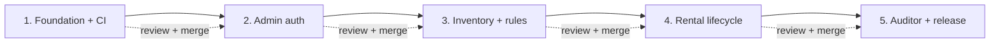

# Hardware Hub Delivery Roadmap

## Summary

Deliver the approved Hardware Hub design as five sequential, independently
reviewable pull requests. Each pull request is a working vertical slice, is
validated by the same minimal CI gate, and must be reviewed and merged before
the next branch starts.

The executable task-by-task plan lives in
[`docs/superpowers/plans/2026-07-22-hardware-hub-roadmap.md`](docs/superpowers/plans/2026-07-22-hardware-hub-roadmap.md).

## Pull Request Sequence

| Slice | Branch | Target | Reviewable outcome | Status |
| --- | --- | ---: | --- | --- |
| 1 | `codex/01-foundation-ci` | 45m | Runnable FastAPI skeleton, injectable TinyDB, Railway guardrails, and one-job CI | Approved design; not started |
| 2 | `codex/02-admin-auth` | 60m | Bootstrap admin, admin-created accounts, opaque-cookie sessions, authorization, and CSRF | Blocked on Slice 1 merge |
| 3 | `codex/03-inventory-rules` | 75m | Lossless seed import, dashboard, admin hardware management, and deterministic safety rules | Blocked on Slice 2 merge |
| 4 | `codex/04-rental-engine` | 60m | Atomic rent/return lifecycle, ownership rules, history, and browser journey | Blocked on Slice 3 merge |
| 5 | `codex/05-auditor-release` | 60m | One-call hybrid audit, safe fallback, final documentation, and verified Railway release | Blocked on Slice 4 merge |

The implementation target is five hours excluding user review latency and
external provider waiting. If a timebox is threatened, reduce visual polish or
extra presentation detail; do not cut authorization, state-transition, lossless
seed, concurrency, deterministic-audit, or LLM-fallback tests.



## Mandatory Slice Workflow

Every slice uses `superpowers:subagent-driven-development` and the same
orchestration contract:

1. The root agent updates this tracker, fixes the slice contract, and creates
   the branch from reviewed `main`.
2. At least two sub-agents receive self-contained, bounded, non-overlapping
   responsibilities with `fork_turns="none"`. Parallel edits are allowed only
   when their file ownership does not overlap.
3. Fresh read-only sub-agents review specification coverage and code/security
   quality in parallel.
4. The root agent resolves findings, runs the full validation gate, commits,
   pushes, and opens exactly one pull request.
5. The pull request contains a small Mermaid DAG showing the slice's system
   flow, plus factual validation results and risks.
6. Work stops until the user reviews and merges or requests changes. No stacked
   implementation pull requests are opened.

Only the root agent owns Git integration. Sub-agents do not commit, push, or
open pull requests from the shared worktree.

## Minimal CI Gate

Keep one Ubuntu job on pull requests and pushes to `main`; do not add matrices,
coverage SaaS, preview environments, or deployment automation.

```text
uv sync --locked --all-extras
uv run ruff format --check .
uv run ruff check .
uv run mypy src
uv run pytest -q
uv build
```

Slice 4 adds Chromium installation to this same job so the single browser
journey runs in CI. Tests never call a live LLM or write to the developer or
Railway database.

## Global Definition of Done

- The slice works end to end and includes its negative-path tests.
- Every TinyDB write, including bootstrap, users, sessions, inventory, and
  history, is serialized through the shared process-wide mutation lock.
- The full CI command set passes with no skipped critical tests.
- UI-changing slices receive a browser smoke check at desktop and narrow widths.
- README and AI-development notes are updated while decisions are fresh.
- The PR body follows the repository template and contains its slice DAG.
- The next slice remains untouched until this PR is approved and merged.

## Release Boundary

`railway.toml` can define the build, start command, and health check. Railway
volume attachment and secrets are external settings, so Slice 5 includes an
explicit setup and verification checklist. Production startup must reject a
TinyDB path outside `RAILWAY_VOLUME_MOUNT_PATH`, preventing accidental writes
to ephemeral storage.

Changing the GitHub repository from private to public and launching the live
service are external publication actions. Slice 5 opens as a draft, pauses for
the user's explicit release approval, performs a full-history secret/content
review, deploys and records the verified URL on that same branch, then returns
for final review and merge. This keeps release completion inside the fifth PR;
no sixth documentation PR is planned.
