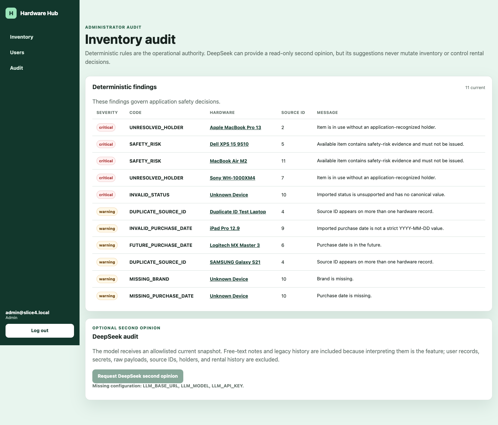

# Hardware Hub

**Live demo:** https://booksy-assignment-production.up.railway.app  
**AI development log:** [`docs/ai-development-log.md`](docs/ai-development-log.md)  
**Architecture and prompt trail:** [`PLANS.md`](PLANS.md)

> Reviewer credentials are shared privately and are not committed to the repository.



Hardware Hub is a focused internal equipment-management application built for Booksy's AI-Native recruitment assessment. It preserves the supplied malformed inventory as immutable evidence, derives trusted canonical fields for operations, blocks objectively unsafe rentals, and provides an administrator-only deterministic and optional DeepSeek inventory audit.

## Assessment coverage

| Requirement | Delivered behavior |
| --- | --- |
| Management engine | Administrator-created accounts, login, role enforcement, hardware create/edit/delete, and repair transitions. |
| Smart dashboard | Name, brand, purchase date, status, server-side filtering and sorting, and anomaly visibility. |
| Rental engine | Guarded rent, owner-only return, administrator release, and append-only attributable history. |
| AI-native layer | Authoritative deterministic inventory rules plus an optional read-only DeepSeek second opinion. |
| Initial data | All 11 supplied records survive, including duplicate IDs and malformed values. |
| Testing | Authentication, import, correction, rental, privacy, provider fallback, deadline, and non-mutation journeys are automated. |
| Deployment | Verified Railway deployment with a persistent `/data` volume and one Uvicorn worker. |

## Stack choice

The assessment permits alternatives when they improve productivity. This implementation uses **Python 3.12, FastAPI, Jinja, TinyDB, and minimal browser JavaScript** instead of a separate Vue frontend.

For this bounded MVP, server-rendered pages keep authentication, authorization, validation, and state transitions inside one testable Python boundary. The supplied wireframes were used as inspiration rather than copied: canonical operational fields are separated from immutable source evidence, ordinary users receive a simpler circulation view, and AI suggestions are visually separated from authoritative deterministic findings.

## Local setup

Prerequisites: Python 3.12 and [`uv`](https://docs.astral.sh/uv/).

```bash
cp .env.example .env
# Replace all example credentials and secrets.
uv sync --locked
uv run uvicorn --app-dir src hardware_hub.app:app --reload
```

Open `http://127.0.0.1:8000/login`.

On first startup, the application creates the bootstrap administrator only when no administrator exists and imports the seed only when the persistent initialization marker is absent.

## Environment variables

| Variable | Required | Purpose |
| --- | --- | --- |
| `ENVIRONMENT` | yes | `development`, `test`, or `production`; production enables Secure cookies. |
| `TINYDB_PATH` | yes | Database path; use `/data/hardware-hub.json` on Railway. |
| `SESSION_SECRET` | yes | Session-signing secret. |
| `BOOTSTRAP_ADMIN_EMAIL` | yes | Initial administrator email. |
| `BOOTSTRAP_ADMIN_PASSWORD` | yes | Initial administrator password. |
| `LLM_BASE_URL` | optional | OpenAI-compatible provider base URL. |
| `LLM_MODEL` | optional | Provider model name. |
| `LLM_API_KEY` | optional | Provider bearer token. |

All three LLM values must be non-blank before the browser action is enabled. Deterministic auditing remains available without them.

## Validation

```bash
uv lock --check
uv sync --locked
uv run ruff format --check .
uv run ruff check .
uv run pytest -q
uv build
```

## Manual product journey

1. Log in as the bootstrap administrator and create an ordinary user.
2. Inspect all 11 imported records, including both source-ID `4` rows and the malformed source `10` record.
3. Correct source `10`; its repairable findings clear while the immutable source payload remains unchanged.
4. Log in as the ordinary user, rent a safe available item, and return it as the owner.
5. Log back in as administrator and review deterministic and optional DeepSeek audit results.

## ✅ Fully implemented

- Administrator-only account creation and authenticated role enforcement.
- Hardware create, edit, hard delete, and repair transitions.
- Lossless import of all supplied source records under generated internal IDs.
- Immutable source evidence beside editable canonical fields.
- Server-side inventory sorting and filtering.
- Guarded ordinary-user rent and owner-only return transitions.
- Administrator release of held hardware with attributable history.
- Deterministic inventory findings that remain the only operational safety authority.
- Optional read-only DeepSeek audit using an allowlisted snapshot, strict schema validation, atomic fallback, and a ten-second total wall-clock deadline.
- Railway deployment with one worker and persistent TinyDB storage.

## ⚡ Shortcuts & hacks

- **Signed cookie instead of persisted sessions or SSO.** Acceptable for the MVP; production needs central revocation and company identity integration.
- **No synchronizer CSRF token.** Strict same-site cookies and POST-only mutations bound the assessment scope; production needs complete CSRF protection.
- **TinyDB with one worker and replica.** Portable and easy to review; production needs a transactional relational database.
- **Initialization marker instead of migrations.** Prevents duplicate seed imports and deleted-row resurrection; production needs explicit schema migrations.
- **Permanent hard deletion.** Meets the assessment requirement but lacks recovery and deletion audit history.
- **One provider call and schema.** No retries, streaming, background jobs, stored runs, or general LLM gateway.
- **Manual browser and deployment smoke tests.** No automated end-to-end or deployment test suite.

## ⚠️ Partial / missing

- Public registration, invitations, password reset/change, session revocation, and SSO.
- Pagination, notifications, due dates, reassignment, rental limits, and user-facing audits.
- Finding acknowledgement/history, automatic repair, AI writes, agents, RAG, and persisted audit runs.
- Multi-worker transactional concurrency, migrations, backups, and automated recovery.
- Hardened free-text redaction, moderation, prompt-injection detection, and request/response size limits.
- Automated browser, load, deployment, and redeploy-persistence tests.

## 🔮 Next steps — another 24 hours

1. Replace TinyDB with PostgreSQL transactions and explicit migrations while preserving the raw/canonical model.
2. Add centrally revocable company authentication, complete CSRF protection, and administrator deletion history.
3. Harden the LLM privacy boundary with redaction, size limits, structured observability, and automated browser/deployment checks.

## AI development disclosure

ChatGPT/Codex assisted with repository exploration, design criticism, implementation, test generation, review, and documentation. Every accepted change was constrained by checked-in specifications, inspected as a diff, and required deterministic tests and CI before handoff.

The full tooling, data strategy, prompt trail, and concrete corrections are documented in [`docs/ai-development-log.md`](docs/ai-development-log.md).

## Railway deployment

`railway.toml` runs one Uvicorn worker:

```text
uv run uvicorn --app-dir src hardware_hub.app:app --host 0.0.0.0 --port $PORT --workers 1
```

Configure one replica, mount a persistent volume at `/data`, set `TINYDB_PATH=/data/hardware-hub.json`, provide sealed authentication secrets, and optionally configure the three LLM variables.

**Live verification:** `/health`, bootstrap login, user creation, all 11 records, source `10` correction, rent/return, deterministic audit, a real DeepSeek response, and persistence across one redeploy were manually verified.