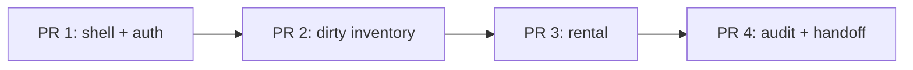
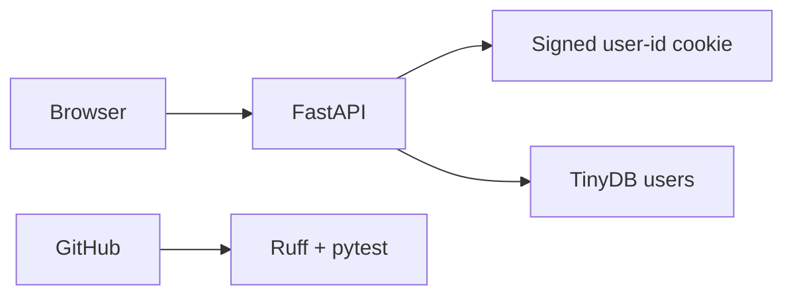
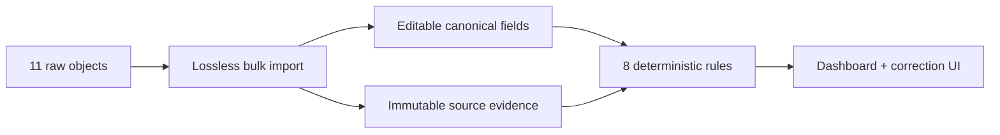
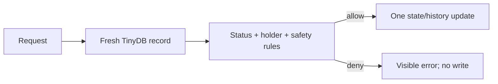
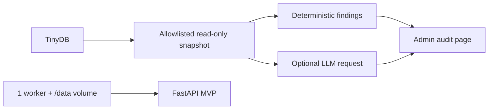

# Hardware Hub MVP Implementation Plan

> **For agentic workers:** REQUIRED SUB-SKILL: Use superpowers:subagent-driven-development (recommended) or superpowers:executing-plans to implement this plan task-by-task. Steps use checkbox (`- [ ]`) syntax for tracking.

**Goal:** Ship one reviewable vertical hardware-management product in four pull
requests.

**Architecture:** FastAPI renders Jinja pages, TinyDB persists one JSON file, and
small feature modules contain authentication, inventory rules, rental mutations,
and audit behavior. A signed cookie stores only the active user's internal ID.
Deterministic validation is the safety authority; the LLM is an optional read-only
second opinion.

**Tech Stack:** Python 3.12, FastAPI, Uvicorn, Jinja2, TinyDB, Pydantic Settings,
pwdlib with Argon2, Starlette SessionMiddleware, HTTPX, HTMX as optional progressive
enhancement, plain CSS, pytest, Ruff, uv, GitHub Actions, Railway.

## Plan Summary

The malformed fixture is the centerpiece. Preserve every supplied JSON object,
give each record a separate internal identity, show the discrepancies to an
administrator, and block objectively unsafe rentals. Do not spend the assignment
building session storage, CSRF infrastructure, migrations, locking, an LLM gateway,
or a browser-test harness.

| Slice | Branch | Browser-visible outcome |
| --- | --- | --- |
| 1 | `codex/01-shell-auth` | App shell, login, admin-created users, visual foundation, minimal CI |
| 2 | `codex/02-dirty-inventory` | Exact dirty import, findings, dashboard, admin CRUD/correction |
| 3 | `codex/03-rental` | Safe rent/return, ownership, history |
| 4 | `codex/04-audit-release` | Deterministic/LLM audit, honest README, Railway-ready config |

This plan assigns no implementation estimates or timeboxes. Agents continue until
the current slice meets its definition of done, then stop at the review gate. Do
not start the next branch before the current PR is approved and merged.



## Rules Shared by Every Slice

### Lightweight agent workflow

- [ ] Root agent creates the slice branch from reviewed `main` and owns all Git
      operations.
- [ ] Dispatch one bounded implementation sub-agent. A second implementer is
      allowed only when its files are disjoint and it saves real time.
- [ ] Root agent integrates and runs the relevant check immediately after each
      meaningful change.
- [ ] Dispatch one fresh read-only sub-agent to compare the finished diff with
      this plan and identify only release-blocking gaps.
- [ ] Root agent fixes valid gaps, runs the complete minimal gate, performs the
      manual smoke checklist, and opens one PR.
- [ ] Sub-agents never commit, push, open PRs, or edit the same file concurrently.

### Minimal automated gate

Every PR must pass exactly this gate locally and in one GitHub Actions Ubuntu job:

```bash
uv sync --locked
uv run ruff format --check .
uv run ruff check .
uv run pytest -q
```

Do not add mypy, coverage thresholds, package builds, Playwright, a CI matrix,
preview environments, or deployment automation.

### Five behavior tests

Keep the suite centered on these five integration-level test functions:

1. `test_admin_creates_user_and_signed_session_enforces_roles`
2. `test_seed_import_is_lossless_idempotent_and_reports_exact_findings`
3. `test_admin_inventory_writes_preserve_raw_evidence`
4. `test_rent_and_return_enforce_safety_ownership_and_history`
5. `test_audit_falls_back_without_mutating_inventory`

A behavior test may make several requests and assertions. Add a sixth test only
for a discovered regression that cannot be proven inside these scenarios; the
target is confidence, not an artificial test count.

### Product invariants

- Never key, update, or deduplicate hardware by the supplied source ID.
- Preserve all 11 raw objects as JSON value-equivalent deep copies. Lossless does
  not mean preserving whitespace or object-key order.
- Never catch and skip malformed seed rows. Parse the full list, then bulk insert.
- Only administrators mutate users or inventory. All state changes use POST.
- Reload the active user on every request and re-read hardware immediately before
  mutation.
- Deploy one Uvicorn worker. There is no multi-worker or contention guarantee.
- Deterministic rules alone can block rental; LLM output cannot mutate or block.
- Escape values while rendering HTML, never by changing persisted data.

### Known security and operational shortcuts

The signed session cookie is tamper-evident, not encrypted or centrally revocable.
`SameSite=Strict` and POST-only forms reduce cross-site request risk but are not a
complete CSRF defense. TinyDB writes are not transactional across workers. Railway
storage correctness depends on the documented `/data` volume configuration. These
trade-offs belong in the README; they do not need infrastructure in code.

---

## Slice 1 — App Shell, Authentication, UI Foundation, and CI

- **Branch:** `codex/01-shell-auth`
- **Outcome:** A bootstrap administrator can log in, create an ordinary user, and
  prove that the user can log in while admin routes remain protected.

### Files

Create:

```text
.env.example
.github/workflows/ci.yml
.gitignore
.python-version
pyproject.toml
uv.lock
src/hardware_hub/__init__.py
src/hardware_hub/app.py
src/hardware_hub/auth.py
src/hardware_hub/config.py
src/hardware_hub/db.py
src/hardware_hub/static/app.css
src/hardware_hub/templates/base.html
src/hardware_hub/templates/login.html
src/hardware_hub/templates/home.html
src/hardware_hub/templates/admin_users.html
tests/conftest.py
tests/test_auth.py
```

### Data and route contract

User documents contain `id`, normalized `email`, `password_hash`, `role`, `active`,
and `created_at`. Use generated UUID strings for internal IDs. The session payload
contains only `user_id`.

Routes:

```text
GET  /health                 public, returns {"status": "ok"}
GET  /login                  public login page
POST /login                  verifies active user and sets signed session
GET  /                       authenticated confirmation page
POST /logout                 clears session
GET  /admin/users            admin only
POST /admin/users            admin only; creates active user
```

### Task 1.1 — Scaffold the runnable service

- [ ] Create `pyproject.toml` with Slice 1 runtime dependencies only: FastAPI,
      Uvicorn, Jinja2, TinyDB, Pydantic Settings, pwdlib with Argon2,
      python-multipart, and itsdangerous. Development dependencies are pytest,
      Ruff, and HTTPX for TestClient. Do not add HTMX or LLM-specific code.
      Configure Ruff for Python 3.12 and pytest's source path.
- [ ] Generate and commit `uv.lock`; never hand-edit it.
- [ ] In `config.py`, define settings for TinyDB path, session secret, environment,
      and bootstrap email/password. Fail clearly when the session secret or
      bootstrap credentials are missing. LLM settings belong to Slice 4.
- [ ] In `db.py`, expose one TinyDB opener plus the `users` table helper. The
      hardware table belongs to Slice 2. Do not create repositories or a unit of
      work.
- [ ] In `app.py`, create the FastAPI app, mount static files, configure templates,
      register `/health`, and close TinyDB on shutdown.
- [ ] Run `uv run ruff check .` and start the app with
      `uv run uvicorn --app-dir src hardware_hub.app:app --reload` long enough to
      verify `/health`.

### Task 1.2 — Write the authentication behavior first

- [ ] Add the shared temporary-database/settings/TestClient fixture in
      `tests/conftest.py`.
- [ ] Write `test_admin_creates_user_and_signed_session_enforces_roles` as one
      journey: bootstrap admin logs in, creates an ordinary user, that user logs in,
      and the ordinary user receives 403 on one admin POST.
- [ ] Run only this test and confirm it fails for the missing behavior:

```bash
uv run pytest tests/test_auth.py -q
```

### Task 1.3 — Implement the smallest authentication flow

- [ ] Hash bootstrap and new-user passwords with Argon2 through pwdlib.
- [ ] Bootstrap the first administrator only when no administrator exists; normalize
      email with `strip().lower()` and reject duplicates.
- [ ] Configure SessionMiddleware with an eight-hour lifetime, `HttpOnly`,
      `SameSite=Strict`, and `https_only=True` only in production.
- [ ] Implement helpers that load the user ID from the signed session, query the
      current active user, and enforce administrator role. Never cache a user in
      the cookie.
- [ ] Implement login, logout, admin user list, and admin user creation with
      `303` redirect-after-POST and one generic visible login error. Store no flash
      messages or form state in the signed session.
- [ ] Run the auth test until it passes. Confirm the application stores only
      `user_id` in the session mapping.

### Task 1.4 — Establish the visual language

- [ ] Build one compact header with the wordmark, current identity, administrator
      link when applicable, POST logout, error region, and content width. Do not
      add a sidebar or future-feature navigation.
- [ ] Define plain-CSS tokens and shared styles for buttons, forms, the user table,
      focus states, and a narrow-width stacked layout. Status and issue components
      belong to Slice 2.
- [ ] Style the login, authenticated home, and user-management pages. Do not create
      a component library, animation system, dark mode, or mockup phase.
- [ ] Manually check the pages at desktop width and approximately 390px width.

### Task 1.5 — Add minimal CI and open PR 1

- [ ] Add one GitHub Actions job containing only the four minimal-gate commands.
- [ ] Run the full gate and fix every failure.
- [ ] Have the read-only reviewer check authentication boundaries, cookie contents,
      CI minimalism, and narrow-layout usability.
- [ ] Commit with a concise subject and a factual body, for example:

```text
feat(auth): add access shell

Adds bootstrap-admin login, admin-created users, signed sessions, the shared UI
foundation, health endpoint, and the minimal Ruff/pytest CI gate.
```

- [ ] Push and open one PR. Include this local-scope DAG in the PR description:



**Manual smoke:** unknown login rejected; signed-cookie tampering logs the browser
out; logout works; narrow layout does not require horizontal page scrolling.

**Review gate:** Stop and wait for user approval and merge.

---

## Slice 2 — Lossless Dirty Seed, Findings, Dashboard, and Admin CRUD

- **Branch:** `codex/02-dirty-inventory`
- **Outcome:** The browser visibly proves that all malformed source records
  survived, and an administrator can correct canonical data without erasing the
  evidence.

### Files

Create:

```text
src/hardware_hub/data/hardware_seed.json
src/hardware_hub/inventory.py
src/hardware_hub/rules.py
src/hardware_hub/templates/_hardware_table.html
src/hardware_hub/templates/dashboard.html
src/hardware_hub/templates/hardware_form.html
tests/test_seed.py
tests/test_inventory.py
```

Modify `app.py`, `db.py`, `base.html`, and `app.css` only to register, store, and
display this slice. Modify `pyproject.toml` only to package `data/*.json`.

### Exact seed fixture

`hardware_seed.json` must contain these 11 objects without correction:

```json
[
  {"id": 1, "name": "Apple iPhone 13 Pro Max", "brand": "Apple", "purchaseDate": "2021-11-23", "status": "Available"},
  {"id": 2, "name": "Apple MacBook Pro 13", "brand": "Apple", "purchaseDate": "2021-12-20", "status": "In Use"},
  {"id": 3, "name": "Razer Basilisk V2", "brand": "Razer", "purchaseDate": "2021-06-05", "status": "Repair"},
  {"id": 4, "name": "SAMSUNG Galaxy S21", "brand": "Samsung", "purchaseDate": "2021-11-23", "status": "Available"},
  {"id": 5, "name": "Dell XPS 15 9510", "brand": "Dell", "purchaseDate": "2022-03-15", "status": "Available", "notes": "Battery swelling, do not issue without service."},
  {"id": 6, "name": "Logitech MX Master 3", "brand": "Logitech", "purchaseDate": "2027-10-10", "status": "Available"},
  {"id": 7, "name": "Sony WH-1000XM4", "brand": "Sony", "purchaseDate": "2022-01-12", "status": "In Use", "assignedTo": "j.doe@booksy.com"},
  {"id": 4, "name": "Duplicate ID Test Laptop", "brand": "Lenovo", "purchaseDate": "2023-01-01", "status": "Repair"},
  {"id": 9, "name": "iPad Pro 12.9", "brand": "Appel", "purchaseDate": "22-05-2023", "status": "Available"},
  {"id": 10, "name": "Unknown Device", "brand": "", "purchaseDate": null, "status": "Unknown"},
  {"id": 11, "name": "MacBook Air M2", "brand": "Apple", "purchaseDate": "2023-08-01", "status": "Available", "history": "Returned by user with liquid damage. Keyboard sticky."}
]
```

### Stored hardware shape

```text
id                     generated internal UUID; the only update/delete key
source_id              original id or null for administrator-created rows
raw_payload            deep-copied original object or null for new rows
name                   canonical required string
brand                  canonical string or null
purchase_date          canonical ISO date string or null
status                 Available | In Use | Repair | null
notes                  editable text initialized from source notes
legacy_history         editable text initialized from source history
holder_user_id         null until an application rental
rental_history         embedded list of application rent/return events
created_at, updated_at timestamps
```

Only exact `YYYY-MM-DD` strings populate the canonical date. Do not use permissive
date parsing. Unsupported or missing statuses remain canonical null. All queries
and form routes use internal `id`, never `source_id`.

### Exact deterministic contract

`find_issues(records, today)` is a pure function returning transient findings. Do
not persist findings, acknowledgements, correction logs, or resolution state. Fix
`today=date(2026, 7, 22)` in tests.

| Code | Severity | Expected source occurrences |
| --- | --- | --- |
| `DUPLICATE_SOURCE_ID` | warning | both `4` rows |
| `FUTURE_PURCHASE_DATE` | warning | `6` |
| `INVALID_PURCHASE_DATE` | warning | `9` |
| `MISSING_BRAND` | warning | `10` |
| `MISSING_PURCHASE_DATE` | warning | `10` |
| `INVALID_STATUS` | critical | `10` |
| `UNRESOLVED_HOLDER` | critical | `2`, `7` |
| `SAFETY_RISK` | critical | `5`, `11` while canonically Available |

That is eight codes and eleven row-level occurrences. Do not flag `Appel`, the
missing source ID `8`, or any inferred typo. Safety checks inspect immutable raw
notes/history as well as current text, so an edit cannot erase imported evidence.

Use this trigger/clear contract; do not invent stored resolution state:

| Finding | Trigger and clear rule |
| --- | --- |
| duplicate | count immutable non-null `source_id`; only explicit deletion changes it |
| future date | canonical date is after `today`; a corrected non-future date clears it |
| invalid date | non-null raw date is not strict ISO and canonical date is null; a valid canonical date clears it |
| missing date | raw date is absent/null and canonical date is null; a valid canonical date clears it |
| missing brand | canonical brand is null/blank; a non-blank canonical brand clears it |
| invalid status | raw status is unsupported and canonical status is null; a supported canonical status clears it |
| unresolved holder | canonical status is `In Use` and holder is null; an explicit admin status correction clears it |
| safety | canonical status is `Available` and immutable raw or current notes/history has battery-swelling or liquid-damage evidence; making it unavailable clears it, while seeded evidence cannot be edited away |

### Task 2.1 — Write the dirty-data contract first

- [ ] In `tests/test_seed.py`, write
      `test_seed_import_is_lossless_idempotent_and_reports_exact_findings`.
- [ ] Assert 11 stored rows, raw payload list equality with the fixture, the original
      source-ID sequence, two distinct internal IDs for source `4`, and no additions
      after a second importer call.
- [ ] Assert the complete 11-item `(code, source_id, internal_id)` finding set. Assert
      explicitly that neither `Appel` nor the ID gap produces a finding.
- [ ] Run this one test and confirm it fails before implementation.

### Task 2.2 — Implement atomic-enough import and pure findings

- [ ] Use one persistent metadata marker so seed initialization runs once per
      database rather than whenever the hardware table is empty. A present marker
      is a no-op; an absent marker with existing hardware records is backfilled
      without importing; an absent marker plus an empty table enters the import
      path. This prevents deleted records from resurrecting after restart.
- [ ] Load and validate that the fixture root is a list of 11 dictionaries before
      opening the import write path. Never key the list by source ID.
- [ ] Build all canonical documents in memory using `deepcopy(raw)`, generated UUIDs,
      and strict date/status conversion; then call TinyDB bulk insert once and write
      the marker only after it succeeds.
- [ ] Include `data/*.json` in setuptools package data so installed builds contain
      the fixture.
- [ ] Implement a small immutable `Finding` dataclass or equivalent plain value in
      `rules.py`; do not introduce a validation framework.
- [ ] Implement the eight rules exactly. An unresolved holder means canonical status
      is `In Use` while `holder_user_id` is null; never match `assignedTo` to a user.
- [ ] Run the seed test until it passes.

### Task 2.3 — Write the admin correction/CRUD behavior first

- [ ] In `tests/test_inventory.py`, write
      `test_admin_inventory_writes_preserve_raw_evidence` as one browser-level HTTP
      scenario.
- [ ] Use one journey: an ordinary user is denied the correction POST; an admin
      corrects source `10` with canonical brand, ISO date, and valid status; exactly
      its three repairable findings disappear while raw `""`, `null`, and
      `"Unknown"`, identity, and row count remain unchanged.
- [ ] Run this one test and confirm it fails before route implementation.

### Task 2.4 — Build the server-rendered inventory slice

- [ ] Add authenticated dashboard filtering and sorting for name, brand, purchase
      date, and status. Accept only an allowlist of sort keys.
- [ ] Normal users see only records with a non-null canonical status. Administrators
      see all 11 records and inline finding badges.
- [ ] Implement one shared create/edit form. Parse the entire submitted form before
      one TinyDB update so invalid input cannot partially modify a record.
- [ ] Implement administrator-only create, edit, hard-delete, mark-repair, and
      clear-repair POST routes with redirect-after-POST.
- [ ] Do not offer `In Use` as a new administrator-selected state. When a holder is
      set, allow metadata correction but reject status changes, repair actions, and
      deletion. Mark repair is holderless `Available → Repair`; clear repair is
      holderless `Repair → Available`.
- [ ] On the edit page, show imported and canonical values side by side. Render
      source `assignedTo` only as `legacy assignee present (redacted)`.
- [ ] Ensure both source-ID `4` rows have distinct internal-ID edit URLs; source `9`
      shows raw `22-05-2023` beside an unset canonical date; source `10` visibly
      shows blank/null/Unknown; and sources `5`/`11` expose safety evidence.
- [ ] Use `_hardware_table.html` as a Jinja include. Add HTMX table replacement only
      if full-page filter/edit behavior is already complete; no acceptance criterion
      depends on JavaScript.
- [ ] Run both inventory tests until they pass.

### Task 2.5 — Validate and open PR 2

- [ ] Run the full minimal gate and manually execute the correction journey below.
- [ ] Have the read-only reviewer search specifically for silent-loss traps:
      dictionary-by-source-ID loading, permissive date parsing, default status,
      per-row catch-and-skip, full-form replacement, source-ID update queries, or
      raw HTML sanitization at write time.
- [ ] Commit with a concise subject and factual body, for example:

```text
feat(inventory): expose dirty seed

Preserves all eleven source records, computes objective findings on demand, and
adds the dashboard plus administrator correction and CRUD flows.
```

- [ ] Push and open one PR with this DAG:



**Manual smoke:** admin sees exactly 11 rows; duplicate source IDs have different
edit links; source `9`, source `10`, and safety evidence are visible; source `7`'s
email is not rendered; correcting source `10` clears exactly three findings while
the original values remain; create/edit/repair/clear/delete work on a holderless
manual row; invalid input makes no partial change; a normal user sees no
canonical-null row or mutation controls.

**Review gate:** Stop and wait for user approval and merge.

---

## Slice 3 — Safe Rent/Return and History

- **Branch:** `codex/03-rental`
- **Outcome:** An ordinary user can rent a safe available item and return only their
  own rental; every accepted action becomes visible history.

### Files

Create:

```text
src/hardware_hub/rental.py
src/hardware_hub/templates/hardware_detail.html
tests/test_rental.py
```

Modify `app.py`, `dashboard.html`, `_hardware_table.html`, and `app.css` only for
route registration and contextual actions.

### Mutation contract

```text
POST /hardware/{internal_id}/rent
POST /hardware/{internal_id}/return
GET  /hardware/{internal_id}
```

Rent succeeds only when the freshly read record has canonical status `Available`,
no holder, and no critical deterministic finding. Return succeeds only when the
freshly read holder is the active user. A successful event contains type, user ID,
and UTC timestamp; rent sets `In Use`, return sets `Available`.

Use an `async` route whose synchronous re-read/validate/update helper contains no
`await`, and run one Uvicorn worker. This narrows the obvious race window but does
not claim transactional concurrency.

### Task 3.1 — Write the full rental journey first

- [ ] In `tests/test_rental.py`, write
      `test_rent_and_return_enforce_safety_ownership_and_history`.
- [ ] Use one journey: source `5` is rejected without mutation; one safe available
      record rents; a second user cannot return it; the owner returns it; and the
      ordered rent/return events contain the correct user IDs.
- [ ] Run the test and confirm it fails before implementation.

### Task 3.2 — Implement one mutation path

- [ ] In `rental.py`, implement small domain helpers that take a freshly loaded
      record and deterministic findings, returning either one complete replacement
      payload or a user-facing error.
- [ ] Implement authenticated POST routes by internal ID. Re-read inside the helper
      immediately before one update and redirect to the detail page afterward.
- [ ] Never rely on a disabled button or stale list-page status for authorization or
      safety.
- [ ] Keep legacy `assignedTo` unresolved. An administrator may explicitly correct
      the canonical status through Slice 2; never auto-link an email to an account.
- [ ] Run the rental test until it passes.

### Task 3.3 — Expose actions and history

- [ ] Add contextual rent/return forms to the dashboard and detail page, with clear
      disabled reasons when an item is unsafe or unavailable.
- [ ] Render newest-first application history without exposing legacy assignee
      emails. Keep the raw imported history visible to administrators as evidence.
- [ ] Verify every state-changing control is a POST form and still works without
      HTMX.

### Task 3.4 — Validate and open PR 3

- [ ] Run the complete minimal gate and the manual two-user journey.
- [ ] Have the read-only reviewer check server-side ownership, fresh re-read,
      deterministic safety enforcement, single-update behavior, and event ordering.
- [ ] Commit with a concise subject and factual body, for example:

```text
feat(rental): add guarded circulation

Adds server-enforced rent and return transitions, owner checks, deterministic
safety blocking, and visible application history.
```

- [ ] Push and open one PR with this DAG:



**Manual smoke:** user rents one safe item; another user cannot return it; owner
returns it; rent/return history is visible; sources `5` and `11` remain blocked even
after editable notes are cleared; admin inventory controls still work.

**Review gate:** Stop and wait for user approval and merge.

---

## Slice 4 — Deterministic/LLM Audit, Documentation, and Railway Readiness

- **Branch:** `codex/04-audit-release`
- **Outcome:** Administrators receive deterministic findings with an optional LLM
  second opinion, and a reviewer can run or deploy the Railway-ready product from
  honest docs.

### Files

Create:

```text
README.md
railway.toml
src/hardware_hub/audit.py
src/hardware_hub/templates/audit.html
tests/test_audit.py
```

Modify `.env.example`, `app.py`, `base.html`, and `app.css` only for configuration,
route registration, navigation, and finding presentation.

### Audit contract

Routes:

```text
GET  /admin/audit             deterministic results; admin only
POST /admin/audit/llm         deterministic + optional LLM; admin only
```

Use one response schema:

```python
class LLMFinding(BaseModel):
    hardware_id: UUID
    severity: Literal["critical", "warning", "info"]
    explanation: str
    recommendation: str


class LLMAuditResponse(BaseModel):
    findings: list[LLMFinding]
```

The allowlisted request snapshot contains internal hardware ID, canonical fields,
notes, legacy history, `legacy_assignee_present: bool`, and deterministic findings.
It excludes user documents, password hashes, session/cookie values, secrets, and
the legacy assignee email. Notes/history remain a documented free-text privacy
risk because interpreting them is the feature.

Make one OpenAI-compatible request to
`{LLM_BASE_URL.rstrip('/')}/chat/completions` with a ten-second HTTPX timeout. Parse
`choices[0].message.content` through the schema and reject findings whose hardware
ID is not in the submitted snapshot. Missing config, transport errors, non-JSON,
or schema errors become one visible warning. Deterministic findings remain intact,
and no audit path writes to inventory.

### Task 4.1 — Write fallback/non-mutation behavior first

- [ ] In `tests/test_audit.py`, write
      `test_audit_falls_back_without_mutating_inventory`.
- [ ] Configure one failing mock transport. Capture inventory before the request;
      assert deterministic findings and one provider warning remain afterward, and
      inventory is exactly unchanged.
- [ ] From that same captured request, assert the snapshot contains no user email,
      password hash, secret, cookie, or raw `assignedTo` value.
- [ ] Run the test and confirm it fails before implementation.

### Task 4.2 — Implement the read-only audit

- [ ] Implement deterministic audit rendering first by reusing `find_issues`; do not
      duplicate rule logic.
- [ ] Implement one snapshot builder, one HTTP call function with an injectable/mock
      transport, and one response parser. Do not add retries, streaming, token
      budgets, background jobs, provider adapters, or stored audit runs.
- [ ] Catch configuration, HTTP, JSON, and Pydantic failures at the audit boundary
      and return one concise warning beside the deterministic results.
- [ ] Add the admin-only page and action. Make it obvious which findings are
      deterministic and which are suggestions.
- [ ] Run the audit test until it passes.

### Task 4.3 — Write the assessment README

- [ ] Document prerequisites, `uv sync --locked`, environment variables, startup,
      bootstrap login, tests, and the four-step manual product journey.
- [ ] Include required assessment sections: implemented behavior; shortcuts and why;
      partial/missing work; top three next-24-hour improvements; AI tooling used;
      data strategy; representative prompt trail; and corrections made after review.
- [ ] State explicitly: signed-cookie limitations, no full CSRF defense, single-worker
      TinyDB constraint, hard-delete limitation, raw free-text privacy risk, LLM
      non-authority, and lack of automated browser tests.
- [ ] Do not claim a live URL, passed check, or production guarantee until verified.

### Task 4.4 — Add the narrow Railway contract

- [ ] Configure one service command:

```text
uv run uvicorn --app-dir src hardware_hub.app:app --host 0.0.0.0 --port $PORT --workers 1
```

- [ ] Document a mounted volume with `TINYDB_PATH=/data/hardware-hub.json`, required
      session/bootstrap secrets, optional LLM settings, and `/health`.
- [ ] Do not add a runtime `/data` path guard, backup automation, deploy workflow,
      multiple replicas, or automatic secret creation.

### Task 4.5 — Validate and open PR 4

- [ ] Run the full minimal gate from a clean environment and perform the entire
      manual smoke path: bootstrap login → create user → inspect/correct dirty data
      → rent/return → deterministic audit with no LLM configuration.
- [ ] Have the read-only reviewer compare the implementation, README claims, privacy
      allowlist, and Railway command with the accepted design.
- [ ] Commit with a concise subject and factual body, for example:

```text
feat(audit): complete MVP handoff

Adds deterministic and optional LLM audit output, deployment configuration, and
assessment documentation with explicit security and operational trade-offs.
```

- [ ] Push and open one PR with this DAG:



- [ ] Wait for explicit user approval before publishing externally.
- [ ] After approved publication, verify `/health`, log in, perform one safe
      rent/return, exercise the LLM once if credentials were supplied, redeploy once,
      and confirm the data persists. Record only verified results and URL in the PR.

**Manual smoke:** all earlier journeys still work; deterministic findings appear
without any LLM settings; Railway configuration names one worker and `/data`.

**Review gate:** Stop for final user review. The MVP is complete only after the PR
is approved, publication (if requested) is verified, and the documented checks are
truthful.

---

## Scope Priorities

If the user explicitly chooses to reduce scope, cut in this order:

1. extra spacing, color, and responsive polish;
2. HTMX replacement behavior—full-page Jinja flows remain authoritative;
3. additional filters, explanatory prose, or LLM prompt sophistication;
4. helper abstractions that do not remove repeated product behavior.

Never cut the working vertical journey, exact 11-record preservation, visible dirty
evidence, source `10` correction demonstration, deterministic rental safety, the
five behavior tests, honest trade-offs, or deployable one-worker configuration.

## Final Definition of Done

- Four PRs, each based on reviewed `main`, each with one local-scope DAG.
- All five behavior tests plus Ruff pass locally and in minimal CI.
- All 11 source records import without silent correction or duplicate loss.
- Browser evidence shows original versus canonical values and redacts the legacy
  email without changing stored data.
- Login, admin user creation, inventory CRUD/correction, rent/return/history, and
  deterministic audit work end to end.
- LLM absence or failure is visible and non-destructive.
- README tells the truth about shortcuts, missing work, AI usage, and next steps.
- Railway is configured for one worker and a `/data` volume; external publication
  happens only with explicit approval.
