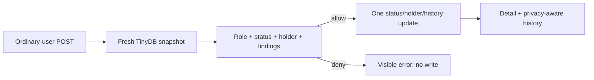

# Slice 3 Safe Rental Implementation Plan

> **For agentic workers:** REQUIRED SUB-SKILL: Use
> `superpowers:subagent-driven-development` to implement this plan task-by-task.
> Every production behavior follows `superpowers:test-driven-development`.

**Goal:** Add ordinary-user-only safe rent/owner-return transitions with embedded,
privacy-aware history and contextual server-rendered controls.

**Architecture:** A synchronous `rental.py` service loads one fresh full-inventory
snapshot, applies deterministic transition guards, constructs a complete replacement,
and performs one TinyDB update. FastAPI routes own authentication/status mapping;
presentation helpers provide already-derived controls and actor labels to Jinja.

**Tech Stack:** Python 3.12, FastAPI, Jinja2, TinyDB, pytest/TestClient, Ruff, plain CSS.

## Global Constraints

- Only active ordinary users may rent or return; administrator transaction POSTs
  return `403` and perform no write.
- An ordinary user may hold multiple items concurrently.
- Rent requires freshly read `Available`, null `holder_user_id`, and no target
  finding with severity `critical`; warning-only items remain rentable.
- Return requires the freshly read holder to equal the active user's internal ID
  and is never blocked by deterministic findings.
- Each accepted transition performs exactly one TinyDB update containing status,
  holder, one appended event, and `updated_at`; unrelated fields remain unchanged.
- Each rejected or repeated transition performs zero writes.
- Events contain exactly `type`, `user_id`, and aware UTC ISO `occurred_at`; the
  exact event timestamp is also written to `updated_at`.
- Stored history remains append-only oldest-first; rendered history is newest-first.
- Ordinary viewers see only `You` / `Another user`; administrators see resolved
  normalized email; missing actors show `Unknown user`; raw user UUIDs never render.
- Legacy `assignedTo` stays unresolved and redacted. Imported history remains
  administrator-only evidence.
- Ordinary users receive `404` for canonical-null detail; known administrator
  transaction POSTs receive the detail-page `403`.
- Successful mutations redirect `303` to detail. Rule rejections render fresh detail
  with `403` or `409`; no flash session state or error query string is added.
- Do not change the seed, stored hardware shape, rule codes, authentication model,
  dependencies, or database helpers. Do not implement Slice 4 behavior.
- All actions are standard POST forms that work without JavaScript.
- Root agent alone owns staging, commits, pushes, screenshot publication, and PR
  creation. Subagents leave Git state untouched and report changes through files.

---

### Task 1: Guarded Rental Domain and HTTP Transitions

**Files:**
- Create: `src/hardware_hub/rental.py`
- Create: `tests/test_rental.py`
- Create: `src/hardware_hub/templates/hardware_detail.html`
- Modify: `src/hardware_hub/app.py`

**Interfaces:**
- Consumes: `hardware_hub.rules.find_issues`, TinyDB `Table`, current active user
  dictionaries, and the Slice 2 hardware document shape.
- Produces:

```python
class RentalConflictError(RuntimeError): ...
class RentalPermissionError(RuntimeError): ...

def rent_hardware(hardware: Table, internal_id: str, user_id: str) -> dict[str, Any] | None: ...
def return_hardware(hardware: Table, internal_id: str, user_id: str) -> dict[str, Any] | None: ...
```

- Produces the routes `GET /hardware/{internal_id}`,
  `POST /hardware/{internal_id}/rent`, and
  `POST /hardware/{internal_id}/return`.
- The initial detail template may be structurally minimal, but it must render the
  canonical item and visible mutation error needed by rejected POST responses. It
  must not render raw `rental_history` or user IDs; Task 2 adds privacy-resolved
  history and completes the presentation.

- [ ] **Step 1: Write the failing HTTP/storage journey**

Create
`test_rent_and_return_enforce_safety_ownership_and_history` in
`tests/test_rental.py`. Use `create_user`, two ordinary users, the existing client,
`Query`, and deep document snapshots. The test must execute these states in order:

```python
# user one: source 5 critical rejection, zero-write equality
# user one: source 1 successful rent, then repeated-rent 409 with zero-write equality
# user one: Available source-ID 4 successful second rent (warning is non-blocking)
# user two: source 1 return 403 with zero-write equality
# administrator: known source 1 rent and return both 403 with zero-write equality
# user one: source 1 successful return, then repeated-return 409 with zero-write equality
```

For accepted source `1`, assert:

```python
assert rented["status"] == "In Use"
assert rented["holder_user_id"] == first_user["id"]
assert [event["type"] for event in rented["rental_history"]] == ["rent"]
assert set(rented["rental_history"][0]) == {"type", "user_id", "occurred_at"}
assert datetime.fromisoformat(rented["updated_at"]).utcoffset() == timedelta(0)
assert rented["updated_at"] == rented["rental_history"][0]["occurred_at"]
```

After owner return, assert `Available`, null holder, exact stored type order
`["rent", "return"]`, the same first-user ID on both events, aware UTC timestamps,
and the return event timestamp equal to final `updated_at`. Assert every unrelated
field equals the corresponding freshly read pre-transition field.

- [ ] **Step 2: Run the focused test and capture RED**

Run:

```bash
uv run pytest -q tests/test_rental.py::test_rent_and_return_enforce_safety_ownership_and_history
```

Expected: FAIL because the rental/detail routes or rental service do not exist.
Record the command, relevant failure, and why it is expected in the task report.

- [ ] **Step 3: Implement the synchronous rental service**

In `rental.py`, use one common snapshot loader and one common updater. The service
shape is:

```python
def rent_hardware(hardware: Table, internal_id: str, user_id: str) -> dict[str, Any] | None:
    records = hardware.all()
    record = next((item for item in records if item.get("id") == internal_id), None)
    if record is None:
        return None
    if record.get("status") != "Available" or record.get("holder_user_id") is not None:
        raise RentalConflictError("This item is not available to rent.")
    if any(
        finding.hardware_id == internal_id and finding.severity == "critical"
        for finding in find_issues(records, date.today())
    ):
        raise RentalConflictError("This item is blocked by a critical safety check.")
    return _apply_transition(hardware, record, "rent", user_id)
```

`return_hardware` uses the same fresh-snapshot lookup. Null holder raises
`RentalConflictError("This item is not currently rented.")`; a different holder
raises
`RentalPermissionError("Only the current holder can return this item.")`; matching
holder calls `_apply_transition` without evaluating findings.

`_apply_transition` must:

```python
occurred_at = datetime.now(UTC).isoformat()
updated = deepcopy(record)
updated["status"] = "In Use" if action == "rent" else "Available"
updated["holder_user_id"] = user_id if action == "rent" else None
updated["rental_history"] = [
    *list(record.get("rental_history", [])),
    {"type": action, "user_id": user_id, "occurred_at": occurred_at},
]
updated["updated_at"] = occurred_at
hardware.update(updated, Query().id == record["id"])
return updated
```

Keep the service synchronous and free of `await`, stored finding state, user-table
lookups, generic state-machine abstractions, and extra persistence calls.

- [ ] **Step 4: Register detail and mutation routes**

In `app.py`, add a focused internal lookup/visibility helper and a reusable detail
response helper. Route precedence is:

```text
current_user -> internal-ID lookup -> ordinary canonical-null concealment
-> ordinary-role requirement for POST -> synchronous service -> response mapping
```

For a successful service result, return:

```python
RedirectResponse(f"/hardware/{internal_id}", status_code=status.HTTP_303_SEE_OTHER)
```

Map `RentalConflictError` to a fresh detail response with `409`,
`RentalPermissionError` to fresh detail with `403`, unknown IDs to `404`, and a
known administrator transaction to the detail template with `403` and
`Administrators cannot rent or return hardware.`. Do not authorize from a button.

- [ ] **Step 5: Run focused GREEN and the full suite**

Run:

```bash
uv run ruff format src/hardware_hub/rental.py src/hardware_hub/app.py tests/test_rental.py
uv run pytest -q tests/test_rental.py::test_rent_and_return_enforce_safety_ownership_and_history
uv run ruff check .
uv run pytest -q
```

Expected: focused rental journey passes; the complete suite passes. The existing
Starlette deprecation warning may remain, but no new warning is accepted.

- [ ] **Step 6: Report for root integration**

Write RED/GREEN evidence, exact commands/results, changed files, and self-review to
the assigned report file. Do not stage or commit. Root independently inspects,
verifies, commits with a factual body, pushes, creates the review package, and
dispatches the task reviewer before Task 2.

---

### Task 2: Privacy-Aware Detail, Dashboard Actions, and History

**Files:**
- Modify: `tests/test_rental.py`
- Modify: `src/hardware_hub/app.py`
- Modify: `src/hardware_hub/templates/hardware_detail.html`
- Modify: `src/hardware_hub/templates/_hardware_table.html`
- Modify: `src/hardware_hub/templates/dashboard.html`
- Modify: `src/hardware_hub/static/app.css`

**Interfaces:**
- Consumes: Task 1's service, routes, errors, event schema, and stored transitions.
- Produces: `_hardware_detail_context`, privacy-resolved history entries, and
  server-derived `rental_action` / `rental_reason` values consumed by both templates.
- Existing administrator edit/repair actions and ordinary dashboard filtering remain
  behaviorally unchanged.

- [ ] **Step 1: Extend the journey with failing presentation/privacy assertions**

Add assertions at the existing journey's natural points:

```python
# Before rent: ordinary dashboard has a source-1 detail link and rent form.
# After rent: owner dashboard/detail has return; source 5 says Blocked by safety check.
# Source 3 says Under repair; source 2 says Unavailable.
# User two detail shows Another user and contains neither ordinary user's email.
# Administrator detail shows first user's normalized email, imported evidence,
# and no rent/return form; source 7's raw assignedTo email is absent everywhere.
# After owner return: within the history container, Return precedes Rent and both
# entries label the actor You.
# Canonical-null source 10 detail is 404 for an ordinary user and 200 for admin.
```

Scope text-order assertions to a stable history element such as
`data-testid="rental-history"`; do not compare page-global `Rent` button text.

- [ ] **Step 2: Run the focused test and capture RED**

Run the same focused pytest node. Expected: FAIL on absent contextual actions,
privacy labels, administrator evidence, or completed detail markup. Record the
specific expected failure before changing production presentation code.

- [ ] **Step 3: Derive one shared circulation presentation state**

In `app.py`, compute findings from the complete current inventory even for ordinary
views, then expose only non-sensitive action/reason values to ordinary templates.
Use this exact priority:

```python
if user["role"] == "admin":
    action, reason = None, None
elif record.get("status") == "Available" and record.get("holder_user_id") is None:
    if any(finding.severity == "critical" for finding in record_findings):
        action, reason = None, "Blocked by safety check"
    else:
        action, reason = "rent", None
elif record.get("status") == "In Use" and record.get("holder_user_id") == user["id"]:
    action, reason = "return", None
elif record.get("status") == "In Use" and record.get("holder_user_id") is not None:
    action, reason = None, "Currently rented"
elif record.get("status") == "In Use":
    action, reason = None, "Unavailable"
elif record.get("status") == "Repair":
    action, reason = None, "Under repair"
else:
    action, reason = None, "Unavailable"
```

Do not copy this branch tree into both dashboard and detail helpers. Give it one
small named helper and use it in both contexts. Continue passing full finding
objects only to administrator markup.

- [ ] **Step 4: Resolve history actors without storing presentation data**

Build a reversed presentation copy of `rental_history`:

```python
actor = (
    users_by_id.get(event["user_id"], {}).get("email", "Unknown user")
    if user["role"] == "admin"
    else "You"
    if event.get("user_id") == user["id"]
    else "Another user"
)
```

Expose a label `Rent` or `Return`, `actor`, and `occurred_at`; never expose the raw
event `user_id` to Jinja. Administrator evidence reuses `_original_import`, which
must retain the existing source-7 email redaction.

- [ ] **Step 5: Complete server-rendered dashboard/detail markup**

- Make every visible hardware name an internal-ID detail link.
- Add an ordinary-user action column with enabled POST forms or a visible disabled
  reason; keep administrator edit/repair controls and add only a detail link.
- The detail page shows canonical fields, status, contextual action/reason, visible
  errors, and newest-first application history.
- Administrator detail additionally shows finding badges and allowlisted original
  import evidence. Ordinary detail renders neither.
- The empty history text is exactly compatible with: `No Hardware Hub rental
  activity has been recorded.`
- Add `data-testid="rental-history"` to the history container.
- No mutation link uses GET and no acceptance behavior depends on JavaScript.

- [ ] **Step 6: Add focused responsive CSS**

Reuse existing cards, badges, buttons, spacing, and color tokens. Add only classes
needed for a two-column detail summary at desktop, a stacked layout around 390 px,
disabled-reason text, and a vertical history list. Do not introduce a component
framework, sidebar destination, animation system, or dark mode.

- [ ] **Step 7: Run focused GREEN and full validation**

Run:

```bash
uv run ruff format src/hardware_hub/app.py tests/test_rental.py
uv run pytest -q tests/test_rental.py::test_rent_and_return_enforce_safety_ownership_and_history
uv run ruff format --check .
uv run ruff check .
uv run pytest -q
```

Expected: focused journey and full suite pass, with no new warning.

- [ ] **Step 8: Report for root integration**

Write RED/GREEN evidence, commands/results, changed files, and self-review to the
assigned report. Do not stage or commit. Root verifies, commits with a factual body,
pushes, and obtains a clean task review before Task 3.

---

### Task 3: Slice Documentation and Release Evidence Preparation

**Files:**
- Modify: `README.md`
- Modify: `docs/ai-development-log.md`
- Modify: `PLANS.md`

**Interfaces:**
- Consumes: the verified Task 1/2 behavior and the approved Slice 3 specification.
- Produces: factual run/use documentation, recorded trade-offs, and roadmap status
  ready for the root agent's screenshot, final review, and PR creation.

- [ ] **Step 1: Document only verified Slice 3 behavior**

Update README behavior/manual-journey sections to cover:

```text
ordinary users only; multiple concurrent holdings; critical findings block rent;
warnings do not; owner-only return; You/Another user privacy; admin email traceability;
single-worker TinyDB limitation; no admin forced return or due dates
```

Preserve existing setup, environment, seed, and Slice 2 documentation. Do not claim
Slice 4 audit, Railway readiness, deployment verification, or broad concurrency.

- [ ] **Step 2: Record implementation decisions in the AI development log**

Add a concise Slice 3 entry containing the user-approved decisions, test-first
journey, subagent/reviewer workflow, any corrections made after review, and the
known Starlette warning. Never include secrets, generated passwords, or private
legacy email values.

- [ ] **Step 3: Update roadmap status without claiming PR completion**

In `PLANS.md`, change Slice 3 status from `Specification awaiting review` to
`Implementation in final validation` only after Tasks 1 and 2 are verified. Leave
Slice 4 blocked on Slice 3 merge.

- [ ] **Step 4: Run documentation and repository checks**

Run:

```bash
git diff --check
rg -n "T[B]D|T[O]DO|F[I]XME" README.md docs/ai-development-log.md PLANS.md
uv run ruff format --check .
uv run ruff check .
uv run pytest -q
uv build
```

Expected: no whitespace/placeholders, Ruff passes, full tests pass, and source/wheel
packages build. Existing dependency warning is recorded rather than misreported.

- [ ] **Step 5: Report for root integration**

Write changed-file summaries and command results to the report. Do not stage or
commit. Root verifies, commits, pushes, and obtains a clean task review.

---

## Root Finalization

After all three task reviews are clean:

1. Run the full locked gate and package build from the integrated task commits.
2. Start the app with a temporary TinyDB and non-secret test settings; execute the
   approved desktop and approximately-390-px browser smoke journey.
3. Capture a representative detail/history screenshot under `docs/assets/`, update
   the Slice 3 `PLANS.md` status to `Implementation complete; PR ready`, commit both
   through the root agent, and push.
4. Generate a whole-branch review package from `git merge-base main HEAD` through
   current `HEAD` and dispatch a fresh high-capability read-only reviewer against
   the Slice 3 spec and this plan.
5. Send every Critical/Important final finding in one batch to one bounded fixer,
   commit/push fixes, and re-review until clean.
6. Run the full locked gate and package build from the final reviewed commit.
7. Open exactly one PR from `codex/03-rental` to `main` with factual summary,
   validation table, screenshot, risks, no breaking changes, and this DAG:



8. Wait for GitHub CI, verify the worktree/remote head are synchronized, mark the
   active goal complete, and stop for user PR review. Do not begin Slice 4.
