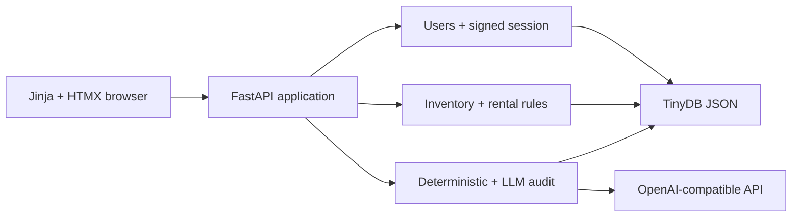

# Hardware Hub MVP Design

## Objective

Build a focused internal hardware-management product. The submission should
demonstrate a complete user journey, sound handling of unreliable source data,
and an honest explanation of shortcuts. It should not attempt to resemble a
production platform.

## Product Thesis

The supplied malformed seed is part of the product problem, not setup noise.
Hardware Hub must preserve what it received, show administrators what is wrong,
and prevent clearly unsafe actions without silently rewriting the source.

That behavior is more valuable to the assessment than sophisticated session,
concurrency, migration, or deployment infrastructure.

## Success Criteria

- A bootstrap administrator can log in and create user accounts.
- Only active, administrator-created users can access the application.
- Users can browse, sort, filter, rent, and return hardware.
- Administrators can add, edit, delete, and toggle repair status.
- All eleven supplied seed records survive import, including the duplicate
  source ID and malformed values.
- Administrators can see deterministic data-quality and safety findings.
- Unsafe, invalid, repaired, or unavailable hardware cannot be rented.
- An administrator can request an LLM-assisted audit, while deterministic
  findings still work when the provider is absent or fails.
- The application can run as one Railway service with persistent TinyDB data.

## Architecture

FastAPI serves Jinja pages enhanced with HTMX and plain CSS. TinyDB stores users
and hardware in one JSON file. Application modules are split by feature only
where it keeps route code readable; there is no repository framework, unit-of-
work abstraction, migration engine, or client-side application state.

The deployment contract is deliberately narrow: one Railway replica and one
Uvicorn worker. Multi-process writes are unsupported and documented.

## Data Model

### User

- generated UUID;
- normalized unique email;
- Argon2id password hash;
- `admin` or `user` role;
- active flag and creation timestamp.

### Hardware

- generated internal UUID independent of the supplied ID;
- nullable source ID and a value-equivalent deep copy of the complete raw source
  object (both null for administrator-created records);
- editable canonical name, brand, purchase date, and status;
- notes and legacy history text;
- current holder user ID for rentals created by this application;
- embedded rent/return history events;
- creation and update timestamps.

Canonical status is `Available`, `In Use`, `Repair`, or null. Invalid imported
dates and statuses remain present in the raw object while their canonical value
is null.

## Authentication

There is no public registration.

The first administrator is created idempotently from
`BOOTSTRAP_ADMIN_EMAIL` and `BOOTSTRAP_ADMIN_PASSWORD` when no admin exists.
Administrators create subsequent users with an initial password.

Passwords use Argon2id. Starlette's signed-cookie session stores only the user
ID and expires after eight hours. Every request reloads that user and rejects an
inactive or missing account. The cookie is `HttpOnly`, `SameSite=Strict`, and
`Secure` in production. Logout clears it.

The signed cookie is tamper-evident but not encrypted or centrally revocable.
The MVP does not implement synchronizer CSRF tokens; all mutations use POST and
the strict same-site cookie. These are explicit assessment shortcuts.

## Seed Import and Dirty-Data Behavior

Import runs once per database, tracked by a small persistent initialization marker.
When the marker is absent, an empty hardware table receives the seed; a non-empty
table is left untouched and marked initialized. The loader parses the complete JSON
array before inserting anything and writes the marker only after the bulk insert.
This prevents both duplicate startup imports and resurrection after an administrator
deletes every row. Every source object receives a new internal UUID, so the two
records with source ID `4` do not collide. The complete original object is retained
as a JSON value-equivalent deep copy; source whitespace and key ordering are not
meaningful.

Only ISO `YYYY-MM-DD` dates and the three supported statuses populate canonical
fields. Administrators edit canonical fields; the raw source remains an audit
reference and is never rewritten.

The deterministic audit emits exactly eight objective rule codes and eleven
row-level occurrences for the supplied fixture:

| Rule | Severity | Affected source records |
| --- | --- | --- |
| `DUPLICATE_SOURCE_ID` | warning | both records with ID `4` |
| `FUTURE_PURCHASE_DATE` | warning | `6` |
| `INVALID_PURCHASE_DATE` | warning | `9` |
| `MISSING_BRAND` | warning | `10` |
| `MISSING_PURCHASE_DATE` | warning | `10` |
| `INVALID_STATUS` | critical | `10` |
| `UNRESOLVED_HOLDER` | critical | `2`, `7` |
| `SAFETY_RISK` | critical | `5`, `11`, only while canonically available |

The misspelled `Appel` brand remains unchanged. It is suitable for an LLM
suggestion but not a deterministic correction.

Finding state is derived, never persisted:

| Finding | Active while | Clears when |
| --- | --- | --- |
| duplicate source ID | immutable source ID occurs more than once | one duplicate is explicitly deleted |
| future purchase date | canonical date is after today | canonical date is today or earlier |
| invalid purchase date | raw date exists, is not strict ISO, and canonical date is null | canonical date is valid |
| missing purchase date | raw date is absent/null and canonical date is null | canonical date is valid |
| missing brand | canonical brand is null/blank | canonical brand is non-blank |
| invalid status | raw status is unsupported and canonical status is null | canonical status is valid |
| unresolved holder | canonical status is `In Use` and application holder is null | an admin explicitly changes status away from `In Use` |
| safety risk | canonical status is `Available` and a safety phrase occurs in immutable raw or current notes/history | canonical status becomes unavailable; seeded evidence cannot be cleared by editing text |

Administrators see findings beside affected hardware and on the audit page.
Normal users do not see canonical-null records. Source `10` is the main correction
demonstration: assigning canonical brand, date, and status clears exactly its three
repairable findings while its raw blank, null, and `Unknown` values remain. Invalid
submissions change nothing. Duplicate provenance warnings cannot be edited away.
Safety inspection always includes immutable imported notes/history, so deleting
editable text cannot erase the evidence; marking the record `Repair` removes the
unsafe-available condition.

## Inventory and Rental Rules

The dashboard supports server-side filtering and sorting by name, brand,
purchase date, and status.

Administrators can create, edit, hard-delete, mark repair, and clear repair.
Hard deletion has no recovery or deletion audit trail; this directly satisfies
the assignment and is documented as an MVP limitation.

Rental state owns `In Use`: administrator forms do not create that status. While
`holder_user_id` is set, metadata may be corrected but status changes, repair
actions, and deletion are rejected. Mark repair is an `Available → Repair`
transition; clear repair is `Repair → Available`; both require no holder. This
prevents an administrator shortcut from producing `Available + holder`.

A rental succeeds only when the current canonical status is `Available`, there
is no current holder, and deterministic findings contain no critical safety
risk. Renting changes status to `In Use`, stores the user ID, and appends one
history event. A user can return only their own rental; returning clears the
holder, restores `Available`, and appends one event.

Each mutation re-reads current state immediately before a single TinyDB update.
There is no process-wide locking or multi-worker guarantee. The single-worker
deployment and lack of `await` between validation and update make this adequate
for assessment traffic; a relational transaction is the production answer.

## AI-Assisted Audit

The audit is admin-triggered and read-only. Deterministic findings always run
first.

When `LLM_BASE_URL`, `LLM_API_KEY`, and `LLM_MODEL` are configured, the app makes
one OpenAI-compatible request containing an allowlisted hardware snapshot and
the deterministic findings. It does not send user, password, cookie, or secret
records. Notes and legacy history are included because interpreting them is the
feature; residual free-text privacy risk is documented.

The response uses one small Pydantic schema with hardware ID, severity,
explanation, and recommendation. Malformed output, missing configuration,
provider errors, or the ten-second HTTP timeout produce a visible warning while
preserving deterministic results. LLM findings never mutate hardware or block a
rental.

## User Interface

The visual foundation is defined in the first slice: a compact desktop-first
layout, restrained brand palette, accessible forms, user-table styles, and a
usable narrow-width layout. Status and issue badges begin in Slice 2. There is no
separate mockup or design-system phase.

Slice 1 owns the branded login card, compact authenticated header, minimal signed-
in page, and administrator user form. Slice 2 replaces the signed-in placeholder
with the primary product experience:

- product navigation;
- sortable/filterable hardware dashboard;
- visible status and data-issue indicators;
- hardware forms and administrator correction controls; and
- inline deterministic findings for administrators.

Slice 3 adds contextual rent/return controls and history. Slice 4 adds the grouped
deterministic/AI audit page. Neither later-slice surface appears as a disabled,
placeholder, or future link in Slice 2.

For administrators, the inventory and edit screens also prove the import rather
than merely claiming it: all eleven rows are visible; both source-ID `4` records
have distinct edit links; source `9` shows its original date beside an unset
canonical date; source `10` shows its three malformed values; and sources `5` and
`11` show their safety evidence. Legacy assignment presence is shown without
rendering source `7`'s email address. Escaping happens only during HTML rendering,
never by rewriting stored values.

If time remains, HTMX may replace the dashboard table fragment. Full-page form
submissions and redirects are authoritative; no acceptance criterion depends on
JavaScript.

## Deployment

Railway runs one Uvicorn worker and mounts a volume at `/data`.

- `TINYDB_PATH=/data/hardware-hub.json`;
- `SESSION_SECRET`, bootstrap credentials, and LLM settings are Railway secrets;
- `/health` returns only `{"status":"ok"}`;
- seed import and bootstrap run at application startup;
- a manual deployment checklist verifies data survives one redeploy.

There is no runtime volume-path guard, backup automation, continuous health
monitoring, or deployment pipeline. Configuration mistakes are operational
risks documented in the README.

## Test Budget

The automated suite focuses on five high-value behaviors:

1. A bootstrap admin creates an ordinary user; both log in, while the ordinary
   user is denied one admin mutation.
2. The seed imports all eleven records idempotently without duplicate-ID loss and
   produces the exact eleven deterministic finding occurrences.
3. An ordinary user is denied the correction; an admin corrects source `10`
   without modifying its raw seed object.
4. One unsafe item is blocked while a safe item completes the owner-only
   rent/return journey with history.
5. One LLM provider failure preserves deterministic findings and inventory.

Ruff and pytest run in one GitHub Actions job. Browser behavior is checked with
a short manual smoke checklist rather than Playwright.

## Explicit Trade-offs

- signed cookie instead of persisted opaque sessions;
- SameSite and POST-only forms instead of synchronizer CSRF tokens;
- one worker and revalidation instead of transactional concurrency control;
- idempotent seed loading instead of a migration framework;
- one response schema and fallback instead of a hardened LLM gateway;
- documented Railway setup instead of runtime storage guards;
- five focused tests and manual browser smoke instead of broad automated E2E.

The README will state these decisions, why they are acceptable for the
assessment, and the production follow-up for each.

## Non-Goals

- public registration, invitations, password reset, or password change;
- session revocation UI;
- pagination or notifications;
- automatic data repair or AI writes;
- finding acknowledgement/resolution workflow;
- multiple workers or replicas;
- automated browser, load, or deployment testing.
