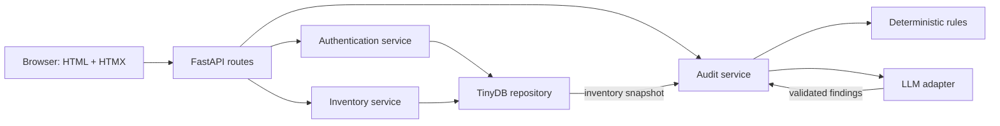

# Hardware Hub Design

## Objective

Build a small internal equipment-management application that demonstrates a
reliable CRUD core, guarded rent/return transitions, admin-created access, and
an AI-assisted inventory audit. The implementation is deliberately optimized
for a four-to-five-hour assessment rather than production scale.

## Success Criteria

- An administrator can create accounts and manage hardware.
- Only administrator-created, active accounts can log in.
- Users can view, sort, filter, rent, and return hardware.
- Invalid transitions, including renting unavailable or unsafe hardware, fail
  without partially changing state.
- The supplied dirty dataset is preserved, imported safely, and visibly
  audited rather than silently corrected.
- The AI layer adds interpretation without becoming a source of truth or a
  prerequisite for core application behavior.
- The application deploys as one service with durable demo data.

## Architecture

The application uses FastAPI for routing and server-side application logic,
Jinja for HTML rendering, HTMX for partial-page interactions, and plain CSS for
the visual layer. It contains no client-side application state and requires no
JavaScript or TypeScript application code.

TinyDB is the persistence layer. The deployed Railway service runs exactly one
replica and one Uvicorn worker with a persistent volume mounted at `/data`.
`TINYDB_PATH` defaults to a repository-local file during development and is set
to `/data/hardware-hub.json` in Railway.

Route handlers remain thin. Authentication, inventory transitions, validation,
and auditing live in separate services. TinyDB access is isolated behind
repositories so a future relational database does not require changing HTTP or
domain behavior.

## TinyDB Safety Boundary

TinyDB does not provide multi-process transactions or ACID guarantees. The MVP
therefore makes its operating boundary explicit:

- one Railway replica;
- one Uvicorn worker;
- one process-wide asynchronous mutation lock;
- every TinyDB mutation, including bootstrap, user, session, rent, return,
  repair, create, update, archive, and seed writes, holds that lock; stateful
  domain operations also re-read and validate current state while holding it;
- all changes to a hardware record and its embedded history are written as one
  repository operation.

This protects the assessment's expected traffic and concurrent requests inside
the one process. Multi-replica deployment is unsupported by design and is
documented as a production limitation.

## Data Model

Pydantic models define the schema at the application boundary even though
TinyDB itself is schema-less.

### User

- generated internal ID;
- normalized, unique email;
- Argon2id password hash;
- role: `admin` or `user`;
- active flag;
- creator ID and creation timestamp.

### Session

- SHA-256 hash of a cryptographically random token;
- user ID;
- random session-bound synchronizer CSRF token;
- creation and expiration timestamps.

### Hardware

- generated internal ID independent of the seed ID;
- preserved source ID and original seed payload;
- canonical name, brand, purchase date, and status when valid;
- notes and legacy history text;
- current holder user ID when rented through the application;
- embedded immutable history events;
- archive timestamp;
- creation and update timestamps.

Canonical status is `Available`, `In Use`, `Repair`, or null when an imported
status is invalid. Null-status records remain visible to administrators but are
never rentable.

### History Event

- action: create, update, rent, return, mark repair, clear repair, or archive;
- actor user ID;
- timestamp;
- small action-specific details payload.

## Seed Import

Import runs only when the hardware collection is empty. Each source record gets
a fresh internal ID, so duplicate source IDs do not collide. The complete input
record is retained for traceability.

Valid dates and statuses are parsed into canonical fields. Invalid values are
retained in the raw payload and represented as null canonical values. Brand
spellings, safety notes, and ambiguous history are never silently rewritten.
The auditor reports them for an administrator to correct.

Imported `In Use` records without a resolvable account remain visible and
blocked from new rental. They are reported as inconsistent legacy assignments.

## Authentication and Authorization

There is no public registration route.

The first administrator is created idempotently from Railway environment
secrets when no admin exists. An authenticated administrator creates subsequent
accounts and supplies an initial password. The initial-password approach is an
explicit MVP shortcut; production would use an expiring invitation.

Login performs the following steps:

1. Normalize the submitted email.
2. Look up an active user and verify the Argon2id password hash.
3. Return the same generic failure for unknown email, inactive account, and bad
   password.
4. Generate a random 256-bit opaque session token.
5. Store only the token's SHA-256 hash with its expiry.
6. Send the raw token in a `__Host-session` cookie configured with `Secure`,
   `HttpOnly`, `SameSite=Strict`, and `Path=/`.

Each protected request hashes the cookie token, resolves an unexpired session,
and loads the active user. Admin routes additionally require the `admin` role.
Sessions expire after eight hours and a new token is issued for every successful
login. Logout deletes the stored session and clears the cookie. State-changing
HTML forms also require a session-bound CSRF token.

## Inventory and Rental Rules

The backend is authoritative; hiding a button is never treated as enforcement.

- Only unarchived hardware with canonical status `Available` and no blocking
  deterministic safety issue can be rented.
- Renting changes the status to `In Use`, records the current holder, and
  appends a rent event while holding the mutation lock.
- A second rent request observes the changed state and fails with a conflict.
- A user can return only hardware currently assigned to that user.
- An administrator may force-return hardware; the action is attributed in
  history.
- Returning clears the holder, changes status to `Available`, and appends a
  return event.
- `Repair` hardware cannot be rented.
- Hardware already `In Use` must be returned before it can enter `Repair`.
- Only non-rented hardware can be archived.

Domain failures return stable categories: unauthenticated, forbidden, not
found, validation error, and state conflict. HTMX responses render a concise
inline error without replacing valid page state.

## Hybrid Inventory Auditor

The audit is an administrator-triggered, read-only operation.

Deterministic rules always check:

- duplicate source IDs;
- missing or blank required fields;
- invalid or future purchase dates;
- invalid statuses;
- `In Use` hardware without a resolvable holder;
- contradictory assignments;
- obvious safety phrases such as battery swelling or liquid damage on
  supposedly available hardware.

Finding severity is `critical`, `warning`, or `info`. Critical deterministic
findings participate in the rental guard. LLM-only findings never block or
mutate hardware regardless of severity.

After rule evaluation, the configured LLM adapter makes exactly one request per
administrator-triggered audit. It receives the small inventory snapshot and
deterministic findings. It may identify ambiguous risks in notes or history and
returns structured findings containing hardware ID, severity, evidence,
explanation, and recommended action. A Pydantic schema rejects unknown IDs,
invalid severities, and malformed output.

The snapshot contains hardware data only. User records, session data,
credentials, and secrets are never included; assignment consistency is conveyed
as an anonymous present-or-missing signal rather than an employee identity.
Before notes or legacy history leave the process, email addresses and common
credential/token patterns are redacted. The outbound DTO never serializes the
raw source payload.

The adapter targets an OpenAI-compatible HTTP API configured through
`LLM_BASE_URL`, `LLM_API_KEY`, and `LLM_MODEL`. The deployed demo configures all
three values and applies a ten-second request timeout. If credentials are absent,
the request times out, or output is invalid, the UI still shows complete
deterministic findings plus a non-blocking provider warning. The LLM never gets
write access, and there is no one-click AI mutation.

## User Interface

The application is desktop-first and remains usable at narrow widths.

- **Login:** email and password form with generic authentication errors.
- **Hardware dashboard:** sortable and filterable table containing name, brand,
  purchase date, status, assignee, and contextual rent/return controls.
- **Admin hardware:** add, edit, mark/clear repair, and archive controls.
- **Admin accounts:** create and list accounts.
- **Admin audit:** grouped deterministic and AI findings with severity,
  evidence, and a link to edit the affected hardware.

Sorting and filtering operate server-side through query parameters. HTMX
replaces only the table or form fragment. Full-page requests produce the same
content, keeping the application functional without HTMX enhancement.

## Deployment

Railway builds and runs the FastAPI service from the Git repository. Production
configuration includes:

- one replica and one Uvicorn worker;
- a persistent volume mounted at `/data`;
- `ENVIRONMENT=production` so the persistent-path guard is active;
- `TINYDB_PATH=/data/hardware-hub.json`;
- `BOOTSTRAP_ADMIN_EMAIL` and `BOOTSTRAP_ADMIN_PASSWORD` stored only as Railway
  secrets;
- `LLM_BASE_URL`, `LLM_API_KEY`, and `LLM_MODEL` stored only as Railway secrets;
- a health endpoint that does not expose configuration or inventory data.

Startup fails closed if Railway runtime markers are present while
`ENVIRONMENT` is not `production`, or if the resolved TinyDB path escapes the
mounted volume.

The free allowance is acceptable for assessment traffic but is not treated as
a production availability guarantee.

## Testing

Tests use a temporary TinyDB path and never call a live LLM.

Critical coverage includes:

1. An unknown account cannot log in and receives no session cookie.
2. An admin-created account can log in.
3. A normal user cannot create accounts or manage hardware.
4. Repair, invalid, or deterministically unsafe hardware cannot be rented.
5. Two concurrent rent attempts yield exactly one success.
6. Only the current renter or an administrator can return hardware.
7. Rent and return operations append attributable history.
8. The supplied seed produces the expected deterministic findings.
9. Malformed or unavailable LLM output falls back to deterministic findings.

At least one end-to-end browser test covers admin account creation followed by
the new user's login and rent/return journey.

## Deliberate Non-Goals

- public registration;
- self-service password changes, password recovery, and email invitations;
- multiple workers or replicas;
- pagination;
- notifications;
- semantic search or chat;
- automatic AI corrections;
- a persistent finding-resolution workflow.

## Documented Trade-offs and Follow-up

The README will explicitly identify TinyDB's single-process limitation,
admin-assigned initial passwords, and free-hosting availability as MVP
shortcuts. The first production improvements would be:

1. Replace TinyDB and the process lock with a transactional relational database.
2. Add expiring account invitations and password recovery.
3. Persist audit findings with acknowledgement and resolution history.
