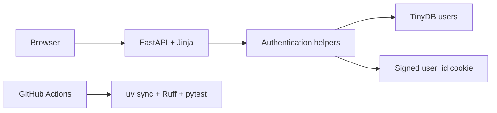
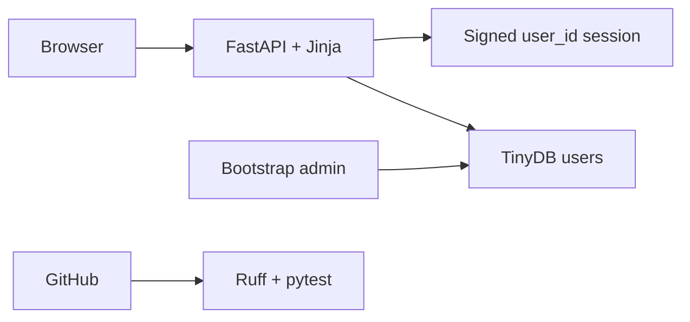

# Slice 1 — Shell and Authentication Specification

- **Status:** Design approved; awaiting written-spec review
- **Branch:** `codex/01-shell-auth`
- **Reference:** [Hardware Hub UI mockup](../../assets/hardware-hub-reference-ui.png)

No implementation duration or timebox applies to this specification. Completion
is determined only by the definition of done and review approval.

## Purpose

Slice 1 proves that the application runs, authentication works, administrators
can create accounts, authorization is enforced, and the visual foundation is
usable. It is a developer-reviewed vertical slice, not a product demo.

The inventory dashboard starts in Slice 2. This slice must not spend time on a
fake dashboard or other UI that will immediately be replaced.

## Reviewable Outcome

A reviewer can:

1. start the application with a temporary TinyDB file;
2. log in as the bootstrap administrator;
3. create one ordinary user;
4. log in as that user;
5. observe that the user cannot perform an administrator mutation;
6. log out; and
7. run the same Ruff and pytest checks used by CI.

## Scope

Slice 1 includes only:

- a runnable FastAPI/Jinja application;
- configuration and TinyDB user storage;
- idempotent bootstrap-administrator creation;
- login and POST logout;
- administrator-only user listing and creation;
- a minimal authenticated confirmation page;
- a public `/health` endpoint;
- a small reusable CSS foundation; and
- one GitHub Actions job for locked install, Ruff, and pytest.

## Explicit Non-Goals

- dashboard, inventory, hardware, rental, history, or audit behavior;
- dashboard metrics, fake data, empty product widgets, or inactive future links;
- sidebar navigation;
- SSO, remember-me, password recovery/change, invitations, or public signup;
- user deactivation, deletion, role editing, or profile management;
- HTMX behavior or other client-side state;
- persisted server-side sessions or session revocation;
- synchronizer CSRF tokens;
- Playwright, mypy, coverage thresholds, or deployment automation;
- Railway configuration or LLM settings.

## Architecture

FastAPI owns routing and request authorization. Jinja renders three small pages
through one base layout. TinyDB stores user documents. Starlette
SessionMiddleware signs a cookie that contains only the current user's internal
ID.



There is no repository layer, service container, session table, migration
framework, or application-wide lock. Feature functions may query the TinyDB
`users` table directly through one database opener.

## Configuration and Lifecycle

Slice 1 reads only:

```text
ENVIRONMENT              development | test | production
TINYDB_PATH              defaults to var/hardware-hub.json
SESSION_SECRET           required
BOOTSTRAP_ADMIN_EMAIL    required
BOOTSTRAP_ADMIN_PASSWORD required
```

Startup creates `TINYDB_PATH`'s parent directory when needed, opens the configured
file, and performs bootstrap initialization. Shutdown closes that database
handle. Missing required settings or invalid bootstrap input fails startup with a
concise error that does not expose values. Hardware, LLM, and Railway-specific
settings do not exist yet.

## Routes and Access

| Method | Path | Access | Behavior |
| --- | --- | --- | --- |
| GET | `/health` | public | Returns exactly `{"status":"ok"}` |
| GET | `/login` | public | Renders the branded login form |
| POST | `/login` | public | Verifies credentials and creates the signed session |
| GET | `/` | authenticated | Shows a minimal signed-in confirmation page |
| POST | `/logout` | authenticated | Clears the session and redirects to `/login` |
| GET | `/admin/users` | administrator | Lists users and shows the create-user form |
| POST | `/admin/users` | administrator | Creates one active ordinary user |

Successful administrator login redirects to `/admin/users`. Successful ordinary
login redirects to `/`. Anonymous protected requests redirect to `/login`.
Authenticated non-administrators receive `403` from both admin routes.

All state changes use POST. Successful login, logout, and user creation return a
`303` redirect. No GET request changes state.

## User Document

```text
id             generated UUID string
email          normalized unique string
password_hash  Argon2 hash; never rendered or logged
role           admin | user
active         boolean
created_at     UTC ISO-8601 timestamp
```

Email normalization is `strip().lower()`. Email must be non-empty and contain a
single `@`; passwords must contain at least eight characters. These are MVP input
checks, not a complete identity policy.

Only the environment bootstrap can create an administrator. The admin form
always creates role `user`; it contains no role selector.

## Bootstrap Behavior

`BOOTSTRAP_ADMIN_EMAIL` and `BOOTSTRAP_ADMIN_PASSWORD` are required for startup.
The application normalizes and validates them using the same rules as the admin
form.

At startup:

- if an administrator exists, bootstrap makes no write;
- otherwise it creates one active administrator with an Argon2 password hash;
- if the bootstrap email already belongs to an ordinary user while no admin
  exists, startup fails rather than promoting or duplicating that account;
- it never replaces an existing administrator's password; and
- it never logs either credential.

This is idempotent startup initialization, not a general migration system.

## Session and Authorization Contract

SessionMiddleware uses `SESSION_SECRET` and an eight-hour maximum age. The cookie
is `HttpOnly`, `SameSite=Strict`, and `Secure` only in production.

The session mapping contains only `user_id`. On every protected request, the app
loads that ID from TinyDB and requires the user still to exist and be active. A
missing, malformed, or tampered cookie is treated as anonymous. A valid session
that references a missing or inactive user is cleared.

The session contains no email, role, cached user object, success message, or form
state. Successful user creation redirects to the updated table; no flash-message
system is required.

The cookie is signed but not encrypted, server-revocable, or centrally stored.
POST-only mutations plus `SameSite=Strict` reduce cross-site request risk but do
not constitute complete CSRF protection. These limitations are deliberate MVP
trade-offs.

## Error Behavior

- Unknown email, inactive user, and incorrect password all produce the same
  `Invalid email or password` response.
- Invalid login does not create or replace an authenticated session.
- Duplicate normalized email produces `User already exists` and no write.
- Invalid create-user input produces one field-level or form-level error and no
  partial user document.
- Validation errors render directly in the response that detected them; they are
  not stored in the session.
- Submitted passwords are never reflected back into HTML.
- Unauthorized admin access returns `403`; it does not rely on hiding a link.
- Unexpected storage failures may return `500`; this slice adds no retry or
  recovery framework.

## UI Contract

The supplied mockup is directional, not a pixel-exact or feature-complete target.
Slice 1 borrows only its visual language:

- deep forest-green brand color;
- pale mint page background;
- white cards with subtle borders and shadows;
- compact system sans-serif typography;
- green primary buttons and restrained secondary actions;
- clear labels, focus rings, and inline error treatment; and
- a simple `H` monogram with `Hardware Hub` wordmark.

### Login page

Use one centered branded card. It contains the wordmark, `Welcome back`, email and
password fields, one primary `Sign in` button, and an error region with
`role="alert"`.

Do not implement the mockup's marketing panel, version badge, remember-me control,
forgot-password link, SSO button, or support footer.

### Authenticated shell

Use a compact top header with the wordmark, current email/role, an admin-users link
only for administrators, and a POST logout form. Do not render a sidebar or links
to future slices.

The `/` page contains one small card confirming that the user is authenticated.
It is intentionally replaceable by the Slice 2 dashboard; it contains no product
metrics or fake empty states.

### Administrator users page

On desktop, render a user table beside a compact create-user form card. On narrow
screens, stack the form and table. The table shows only email, role, active state,
and creation time. It exposes no password hash or mutation controls beyond user
creation.

The layout must remain usable at approximately 390px width. Horizontal scrolling
inside the table container is acceptable; horizontal page scrolling is not.

## File Boundary

```text
.env.example                              documented Slice 1 settings
.github/workflows/ci.yml                  one minimal validation job
.python-version, pyproject.toml, uv.lock  Python and locked dependencies
src/hardware_hub/app.py                  app composition, routes, lifespan, health
src/hardware_hub/config.py               Slice 1 settings only
src/hardware_hub/db.py                   TinyDB opener and users table helper
src/hardware_hub/auth.py                 bootstrap, credentials, session, guards
src/hardware_hub/templates/base.html     authenticated shell
src/hardware_hub/templates/login.html    login page
src/hardware_hub/templates/home.html     minimal authenticated page
src/hardware_hub/templates/admin_users.html
src/hardware_hub/static/app.css          shared tokens and Slice 1 styles
tests/conftest.py                        isolated app/database fixture
tests/test_auth.py                       one vertical auth test
```

Business decisions belong in Python helpers, not templates. Templates render
already-authorized state and POST forms; CSS contains no behavior.

## Automated Evidence

The slice adds one integration test:

`test_admin_creates_user_and_signed_session_enforces_roles`

The single journey proves:

1. the bootstrap administrator can log in;
2. the administrator can create an ordinary user;
3. the new user can log in; and
4. the ordinary user receives `403` from one admin POST without creating a user.

Do not expand this into a matrix of cookie, validation, and role tests. Those
paths belong in the manual smoke check unless a real regression is discovered.

## Manual Smoke Check

- `/health` returns only the expected JSON;
- invalid credentials show the generic error;
- a duplicate normalized email is rejected;
- changing the session cookie makes the next protected request anonymous;
- POST logout clears access;
- login, authenticated home, and admin users remain usable at desktop and 390px;
- there are no dead navigation items or later-slice product UI.

## Minimal CI

One Ubuntu job runs on pull requests and pushes to `main`:

```text
uv sync --locked
uv run ruff format --check .
uv run ruff check .
uv run pytest -q
```

## Definition of Done

- The reviewable journey works end to end.
- The one integration test and complete minimal gate pass.
- The manual smoke check passes at both widths.
- Only Slice 1 routes, data, templates, dependencies, and settings exist.
- The PR body includes factual validation, explicit shortcuts, and this DAG:



- The PR stops for review before any Slice 2 file or behavior begins.
