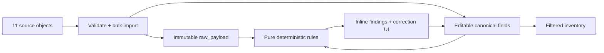
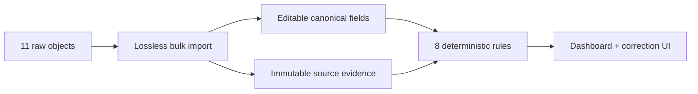

# Slice 2 — Dirty Inventory Specification

- **Status:** Implemented; awaiting pull-request review
- **Branch:** `codex/02-dirty-inventory`
- **Reference:** [Hardware Hub UI mockup](../../assets/hardware-hub-reference-ui.png)

No implementation duration or timebox applies to this specification. Completion
is determined only by the definition of done and review approval.

## Purpose

Slice 2 replaces the authenticated placeholder with the primary inventory
experience. It proves that malformed input can be preserved without becoming
operational truth: all 11 supplied records survive import, objective problems are
derived visibly, and an administrator can correct canonical data without rewriting
the source evidence.

The malformed fixture is the feature. This slice must not hide its anomalies behind
automatic cleanup, inferred corrections, or a polished but fictitious dashboard.

## Reviewable Outcome

A reviewer can:

1. start the application with an empty TinyDB file and observe exactly 11 hardware
   rows;
2. see both source-ID `4` records with different internal-ID edit links;
3. inspect the malformed source values and deterministic findings as an
   administrator;
4. filter and sort the inventory with full-page GET requests;
5. create, edit, mark for repair, clear repair, and hard-delete a holderless manual
   record;
6. correct source `10` and see exactly three findings clear while its original
   payload remains unchanged;
7. log in as an ordinary user and observe neither canonical-null records nor
   administrator evidence or controls; and
8. run the same locked-install, Ruff, and pytest checks used by CI.

## Scope

Slice 2 includes only:

- idempotent first-run import of the exact 11-object fixture;
- generated internal identities and immutable raw-source payloads;
- editable canonical hardware fields;
- eight pure deterministic rules producing 11 initial occurrences;
- an authenticated, server-rendered inventory dashboard;
- GET-based field filtering and allowlisted sorting;
- administrator-only create, edit, hard-delete, mark-repair, and clear-repair
  operations;
- a compact two-item desktop sidebar with a no-JavaScript narrow layout;
- inline findings and side-by-side source/canonical correction UI; and
- two focused integration tests.

## Explicit Non-Goals

- rent, return, ownership, or application history behavior;
- rental buttons, fake assignees, due dates, locations, categories, or metrics;
- an audit page, LLM configuration, LLM calls, or AI-generated findings;
- automatic correction of `Appel`, legacy assignee matching, or inferred source
  records;
- finding acknowledgement, stored resolution, correction history, or soft delete;
- pagination, bulk actions, dashboard charts, or notifications;
- HTMX or any acceptance criterion that depends on JavaScript;
- a repository layer, unit of work, migration framework, or write coordinator;
- multi-worker safety, concurrency stress tests, or browser automation.

## Architecture and Boundaries

FastAPI continues to own HTTP composition and authorization. `inventory.py` owns
seed conversion, form validation, queries, and inventory mutations. `rules.py`
owns only pure finding calculation. `db.py` exposes named TinyDB hardware and
metadata tables just as it already exposes the users table.



Templates render values and precomputed presentation state. They may select
styles, labels, and visible controls, but they do not authorize requests, validate
transitions, calculate safety, or write data. Every administrator POST repeats its
authorization and current-record checks server-side even when the corresponding
button was hidden.

No new production dependency is required.

## Database Boundary

TinyDB continues to store one JSON database with named `users`, `hardware`, and
`metadata` tables. `db.py` adds only:

```python
def hardware_table(db: TinyDB) -> Table:
    return db.table("hardware")


def metadata_table(db: TinyDB) -> Table:
    return db.table("metadata")
```

Application lifespan stores those handles as `app.state.hardware` and
`app.state.metadata`. The metadata table stores one initialization document keyed
as `hardware_seed_loaded`; it is not a migration framework or deletion log. The
helpers centralize table names; they do not contain validation, filtering, rules,
authorization, or CRUD policy.

## Exact Seed Fixture

`src/hardware_hub/data/hardware_seed.json` contains these objects without
correction, reordering, or omission:

```json
[
  {"id": 1, "name": "Apple iPhone 13 Pro Max", "brand": "Apple", "purchaseDate": "2021-11-23", "status": "Available"},
  {"id": 2, "name": "Apple MacBook Pro 13", "brand": "Apple", "purchaseDate": "2021-12-20", "status": "In Use"},
  {"id": 3, "name": "Razer Basilisk V2", "brand": "Razer", "purchaseDate": "2021-06-05", "status": "Repair"},
  {"id": 4, "name": "SAMSUNG Galaxy S21", "brand": "Samsung", "purchaseDate": "2021-11-23", "status": "Available"},
  {"id": 5, "name": "Dell XPS 15 9510", "brand": "Dell", "purchaseDate": "2022-03-15", "status": "Available", "notes": "Battery swelling, do not issue without service."},
  {"id": 6, "name": "Logitech MX Master 3", "brand": "Logitech", "purchaseDate": "2027-10-10", "status": "Available"},
  {"id": 7, "name": "Sony WH-1000XM4", "brand": "Sony", "purchaseDate": "2022-01-12", "status": "In Use", "assignedTo": "j.doe@booksy.com"},
  {"id": 4, "name": "Duplicate ID Test Laptop", "brand": "Lenovo", "purchaseDate": "2023-01-01", "status": "Repair"},
  {"id": 9, "name": "iPad Pro 12.9", "brand": "Appel", "purchaseDate": "22-05-2023", "status": "Available"},
  {"id": 10, "name": "Unknown Device", "brand": "", "purchaseDate": null, "status": "Unknown"},
  {"id": 11, "name": "MacBook Air M2", "brand": "Apple", "purchaseDate": "2023-08-01", "status": "Available", "history": "Returned by user with liquid damage. Keyboard sticky."}
]
```

Seed initialization follows this exact order:

1. if the `hardware_seed_loaded` marker exists, do nothing even when the hardware
   table is empty;
2. if the marker is absent but hardware is already non-empty, write the marker and
   leave those records untouched;
3. otherwise parse and verify that the fixture root is a list containing exactly
   11 dictionaries;
4. construct all 11 documents in memory and call TinyDB bulk insert once; and
5. write the marker only after the bulk insert succeeds.

The non-empty-table recovery guard prevents duplicate imports if startup stopped
after the bulk insert but before its marker write. The persistent marker prevents
an administrator who explicitly deletes every hardware document from seeing all
11 source records resurrect after restart. Removing the TinyDB file creates a new
database and intentionally permits a fresh first-run import.

The importer never keys, deduplicates, or updates by source ID, and it never catches
and skips an individual row.

## Stored Hardware Contract

Each hardware document contains:

| Field | Contract |
| --- | --- |
| `id` | Generated UUID string; the only route, lookup, update, and delete identity. |
| `source_id` | Original `id`, or null for administrator-created hardware. |
| `raw_payload` | Value-equivalent `deepcopy` of the complete source object, or null for administrator-created hardware. |
| `name` | Required non-blank canonical string. |
| `brand` | Canonical string or null. |
| `purchase_date` | Canonical strict ISO `YYYY-MM-DD` string or null. |
| `status` | `Available`, `In Use`, `Repair`, or null. |
| `notes` | Editable text initialized from source `notes`, otherwise empty. |
| `legacy_history` | Editable text initialized from source `history`, otherwise empty. |
| `holder_user_id` | Null in this slice; reserved for rentals created by Slice 3. |
| `rental_history` | Empty list in this slice; reserved for Slice 3 events. |
| `created_at` | UTC ISO timestamp assigned on import or creation. |
| `updated_at` | UTC ISO timestamp updated after an accepted mutation. |

`raw_payload` is never replaced or patched by create/edit/repair routes. Hard
deletion explicitly removes the whole document, including its evidence; there is
no recovery or deletion log.

### Canonical Conversion

The source payload answers “what did we receive?” Canonical fields answer “what
may the application use?” Both are necessary because the product must preserve
bad input while allowing correction.

- exact supported status strings populate canonical status;
- an unsupported or absent status produces canonical null;
- a date populates `purchase_date` only when it is a string that exactly matches
  `YYYY-MM-DD` and represents a real calendar date;
- a missing, null, or invalid date produces canonical null;
- a blank source brand produces canonical null;
- source notes and history initialize their editable counterparts without
  changing the raw payload; and
- source `assignedTo` is preserved only inside `raw_payload`; it never becomes a
  Hardware Hub holder.

Source `10` therefore begins with raw blank/null/`Unknown` values and canonical
brand/date/status all null. Correcting its canonical fields does not change those
raw values.

## Deterministic Finding Contract

`find_issues(records, today)` is a pure function returning immutable finding
values. It reads no database or environment state, performs no writes, and makes
no external call. Findings are recomputed when needed and are never persisted,
acknowledged, or manually resolved.

Each finding contains at least:

```text
code          one of the eight exact rule codes
severity      warning | critical
hardware_id   generated internal UUID
source_id     imported source ID or null
```

Tests pass `today=date(2026, 7, 22)` and assert the complete initial set:

| Code | Severity | Expected source occurrences |
| --- | --- | --- |
| `DUPLICATE_SOURCE_ID` | warning | both records with source ID `4` |
| `FUTURE_PURCHASE_DATE` | warning | `6` |
| `INVALID_PURCHASE_DATE` | warning | `9` |
| `MISSING_BRAND` | warning | `10` |
| `MISSING_PURCHASE_DATE` | warning | `10` |
| `INVALID_STATUS` | critical | `10` |
| `UNRESOLVED_HOLDER` | critical | `2`, `7` |
| `SAFETY_RISK` | critical | `5`, `11` while canonically `Available` |

The initial fixture therefore produces exactly eight codes and 11 row-level
occurrences: six warnings and five critical findings.

### Trigger and Clear Rules

| Finding | Active while | Clears when |
| --- | --- | --- |
| Duplicate source ID | A non-null immutable `source_id` occurs more than once. | One duplicate document is explicitly hard-deleted. |
| Future purchase date | Canonical date is after `today`. | Canonical date becomes `today` or earlier. |
| Invalid purchase date | Raw date is non-null, fails strict date validation, and canonical date is null. | Canonical date becomes valid. |
| Missing purchase date | Raw date is absent/null and canonical date is null. | Canonical date becomes valid. |
| Missing brand | Canonical brand is null/blank. | Canonical brand becomes non-blank. |
| Invalid status | Raw status is unsupported and canonical status is null. | Canonical status becomes `Available` or `Repair`. |
| Unresolved holder | Canonical status is `In Use` and `holder_user_id` is null. | An administrator explicitly changes status to `Available` or `Repair`. |
| Safety risk | Canonical status is `Available` and safety evidence exists. | Canonical status becomes unavailable; immutable evidence remains. |

Safety evidence is a case-insensitive occurrence of the literal phrase `battery
swelling` or `liquid damage` in either immutable raw notes/history or editable
notes/history. Clearing editable text cannot erase imported evidence. Marking an
item `Repair` removes the unsafe-available condition; changing it back to
`Available` makes the finding return.

`Appel` is not objectively provable as a typo, and source IDs are not required to
be contiguous. Therefore neither `Appel` nor missing source ID `8` produces a
deterministic finding. A later LLM may suggest review, but LLM output can never
clear, create, or override these authoritative rules.

## Dashboard Query Contract

`GET /` becomes the authenticated inventory dashboard. It uses full-page GET
requests and supports these optional query parameters:

| Parameter | Behavior |
| --- | --- |
| `name` | Case-insensitive canonical-name substring. |
| `brand` | Exact canonical brand selected from the available non-blank brands. |
| `purchase_date` | Exact canonical strict ISO date. |
| `status` | Exact canonical `Available`, `In Use`, or `Repair`; `Needs correction` maps only to canonical null. |
| `sort` | Allowlisted `name`, `brand`, `purchase_date`, or `status`; default `name`. |
| `direction` | `asc` or `desc`; default `asc`. |

Filters combine with AND. Sorting is case-insensitive for strings, places nulls
last in either direction, and uses internal UUID as the stable tie-breaker. Unknown
status, sort, or direction values and invalid date filters render a visible
dashboard error with HTTP `400`; they are not silently interpreted.

Administrators query all documents. Ordinary users query only records whose
canonical status is non-null. Filter and sort state remains visible in the
returned form controls.

## UI Contract

The approved structural direction is a compact sidebar inspired by the supplied
mockup. The mockup supplies visual language, not data, routes, or additional
features.

### Authenticated shell

At desktop width, a deep forest sidebar contains exactly:

- the Hardware Hub wordmark;
- `Inventory`, linked to `/`;
- `Users`, linked to `/admin/users` and rendered only for administrators;
- current email and role; and
- the existing POST logout form at the bottom.

There are no disabled or future navigation items. At approximately 720px and
below, the sidebar becomes a compact top header/navigation that wraps without
JavaScript. At approximately 390px, the page itself must not scroll horizontally;
the inventory table may scroll inside its own container.

### Inventory dashboard

The primary hierarchy is:

1. `Hardware inventory` heading;
2. administrator proof text showing the current imported count against the original
   fixture count, initially `11 of 11 source records present`;
3. administrator-only `Add hardware` action;
4. compact filter/sort controls;
5. a derived administrator finding/active-rule summary, initially `11 findings
   across 8 rules`; and
6. one dominant inventory table.

The dashboard contains no metric cards, separate findings panel, audit CTA, rent
control, or invented product dimension.

Administrator rows show source ID, canonical values, status, compact finding
badges, and an internal-ID edit link. Ordinary-user rows omit source ID, findings,
evidence, and administrator actions.

### Evidence and correction page

The edit page shows two clearly labeled regions:

- **Original import:** read-only allowlisted source fields;
- **Application values:** editable canonical fields.

It never dumps the complete raw JSON into HTML. For source `7`, it renders only
`Legacy assignee present — redacted`; the source email is never rendered. Source
`9` shows raw `22-05-2023` beside an unset canonical date. Source `10` shows raw
blank/null/`Unknown` beside its unset canonical values. Sources `5` and `11` show
their safety evidence to administrators. Both source-ID `4` rows link to different
internal-ID edit URLs.

Jinja escaping is the only HTML-safety transformation. Stored raw and canonical
text is never rewritten to sanitize markup.

## Administrator Route Contract

```text
GET  /admin/hardware/new                  create form
POST /admin/hardware                      create manual hardware
GET  /admin/hardware/{internal_id}/edit   correction/edit form
POST /admin/hardware/{internal_id}/edit   validate and update canonical fields
POST /admin/hardware/{internal_id}/delete hard-delete one document
POST /admin/hardware/{internal_id}/mark-repair
POST /admin/hardware/{internal_id}/clear-repair
```

Every route requires a freshly loaded active administrator. Anonymous requests
redirect to `/login`; authenticated ordinary users receive `403`; unknown internal
IDs receive `404`. All accepted POSTs use redirect-after-POST with `303`.

### Form Validation

The complete submitted form is parsed into a candidate before one TinyDB write:

- name is trimmed and must remain non-blank;
- brand is trimmed, with blank normalized to null;
- purchase date is blank/null or one valid strict ISO calendar date;
- future dates are accepted and produce a warning rather than being rejected;
- administrator-created hardware selects only `Available` or `Repair`;
- edit forms provide `Keep current`, `Available`, and `Repair`; they never offer
  `In Use` as an administrator-created state;
- notes and legacy history remain editable text and are escaped only at render;
  and
- `source_id`, `raw_payload`, internal ID, holder, rental history, and creation
  timestamp never come from the form.

If any field is invalid, the response is HTTP `400`, shows a safe validation
message, retains non-secret submitted values, and performs no write. Unexpected
storage failures may return `500`; this slice adds no retry framework.

### Mutation Invariants

- Every mutation queries by internal UUID and re-reads the current document before
  one update or removal.
- Manual creation stores null `source_id`/`raw_payload`, null holder, empty rental
  history, and generated identity/timestamps.
- Metadata may be corrected while `holder_user_id` is set, but status changes,
  repair actions, and deletion are rejected with `409`.
- Mark repair is exactly holderless `Available → Repair`.
- Clear repair is exactly holderless `Repair → Available`.
- Other repair-state requests are rejected with `409` and no write.
- An imported unresolved `In Use` record has no application holder. An
  administrator may explicitly correct it to `Available` or `Repair`; source
  `assignedTo` is never matched to a user.
- Hard deletion is permanent, has no confirmation state stored in the session,
  and removes exactly the internal-ID document selected.

These checks are enforced in Python even if a stale page or crafted request sends
a control the current UI would not show.

## File Boundary

Create:

```text
src/hardware_hub/data/hardware_seed.json       exact fixture
src/hardware_hub/inventory.py                  import, query, validation, mutations
src/hardware_hub/rules.py                      pure deterministic findings
src/hardware_hub/templates/_hardware_table.html
src/hardware_hub/templates/dashboard.html
src/hardware_hub/templates/hardware_form.html
tests/test_seed.py
tests/test_inventory.py
```

Modify only as required:

```text
src/hardware_hub/app.py                        lifespan and route composition
src/hardware_hub/db.py                         hardware and metadata table helpers
src/hardware_hub/templates/base.html           approved product navigation
src/hardware_hub/static/app.css                 badges, dashboard, form, responsive shell
pyproject.toml                                  package `data/*.json`
README.md                                       actual Slice 2 behavior/trade-offs
docs/ai-development-log.md                      actual implementation decisions/corrections
```

Do not create a repository package, schema migration, audit module/page, rental
module/page, JavaScript bundle, or new dependency.

## Automated Evidence

### `test_seed_import_is_lossless_idempotent_and_reports_exact_findings`

One test proves:

1. the stored row count is 11;
2. ordered raw payloads are value-equal to the fixture;
3. the source-ID sequence, including both `4` values and absent `8`, is unchanged;
4. the two source-ID `4` documents have distinct internal UUIDs;
5. running the importer again inserts nothing;
6. emptying the hardware table after initialization and rerunning the importer does
   not resurrect deleted source records;
7. the complete `(code, source_id, hardware_id)` finding set contains exactly the
   expected 11 occurrences; and
8. neither `Appel` nor the ID gap produces a finding.

### `test_admin_inventory_writes_preserve_raw_evidence`

One HTTP journey proves:

1. an ordinary user receives `403` from the source `10` correction POST;
2. no unauthorized mutation occurs;
3. the administrator changes canonical brand, date, and status with one accepted
   POST;
4. exactly source `10`'s missing-brand, missing-date, and invalid-status findings
   clear;
5. its raw blank/null/`Unknown` values remain unchanged;
6. its internal identity and total row count remain unchanged; and
7. both duplicate and immutable safety evidence remain intact.

Do not expand these into broad helper-unit matrices. Add another test only for a
real regression that cannot be proven inside the two journeys.

## Manual Smoke Check

- empty-database startup shows exactly 11 administrator rows;
- a second startup does not duplicate them;
- explicitly deleting all hardware and restarting does not reimport the fixture;
- both source-ID `4` records have distinct edit links;
- source `9`, source `10`, and safety evidence are visible as specified;
- source `7`'s email does not appear anywhere in rendered HTML;
- correcting source `10` clears exactly three findings while the original values
  remain visible;
- invalid input changes nothing;
- full-page name/brand/date/status filters and all four sort keys work;
- create/edit/repair/clear/delete works for a holderless manual record;
- an ordinary user cannot access administrator mutations and sees no
  canonical-null row or finding evidence; and
- desktop and approximately 390px layouts remain usable without horizontal page
  scrolling.

## Minimal CI

Slice 2 preserves the existing single-job gate:

```text
uv sync --locked
uv run ruff format --check .
uv run ruff check .
uv run pytest -q
```

No dependency, CI job, typechecker, coverage service, package build, or browser
runner is added.

## Definition of Done

- The reviewable outcome works end to end in the browser.
- The two Slice 2 integration journeys and the complete existing suite pass.
- The full minimal gate passes locally and in CI.
- Desktop and narrow-width smoke checks pass.
- All 11 raw objects and the exact initial finding set are proven by tests.
- README and AI-development notes describe actual shortcuts and corrections.
- A fresh read-only reviewer finds no release-blocking silent-loss,
  authorization, mutation, redaction, or scope gap.
- The PR body reports factual validation, deliberate omissions, and this DAG:



- The PR stops for review before any Slice 3 behavior begins.
