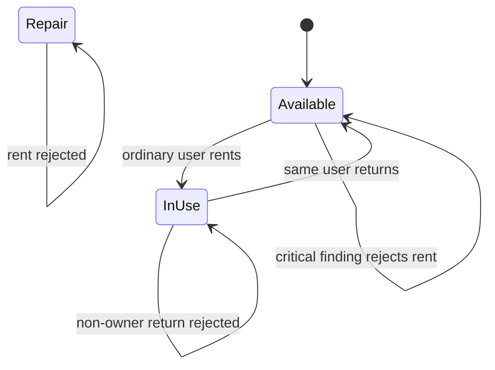
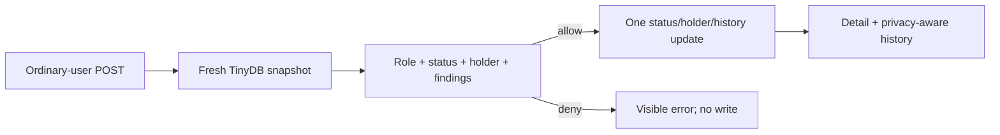

# Slice 3 — Safe Rent/Return and History Specification

- **Status:** Approved; implementation complete; PR-ready
- **Branch:** `codex/03-rental`
- **Depends on:** merged Slice 2 inventory and deterministic findings

No implementation duration or timebox applies to this specification. Completion
is determined only by the definition of done and review approval.

## Purpose

Slice 3 turns the read-only ordinary-user inventory into a guarded circulation
flow. An ordinary user can rent safe hardware, can hold more than one item, and
can return only hardware currently assigned to that same account. Every accepted
transition appends structured application history without rewriting imported
evidence.

The server owns every decision. A visible or disabled button is explanatory only;
the mutation path reloads the current TinyDB document and repeats all status,
holder, role, and deterministic-finding checks immediately before one update.

## Reviewable Outcome

A reviewer can:

1. log in as an ordinary user and rent two safe available items;
2. rent an item carrying only a warning, proving warnings do not block circulation;
3. see source `5` rejected because its critical safety finding is active;
4. log in as a second ordinary user and fail to return the first user's item;
5. return the item as its current holder;
6. see newest-first rent/return history while ordinary-user identities remain
   private;
7. see resolved renter emails when viewing the same history as an administrator;
8. observe that administrators can inspect history but cannot rent or return; and
9. verify that every rejected request leaves status, holder, history, and
   `updated_at` unchanged.

## Scope

Slice 3 includes only:

- authenticated hardware detail pages;
- contextual rent/return controls on the dashboard and detail page;
- ordinary-user-only rent and return POST routes;
- administrator release of an application-held item through the existing edit POST;
- fresh-record validation against status, holder, ownership, and critical
  deterministic findings;
- one complete TinyDB update for each accepted transition;
- structured embedded rent/return and administrator-release events;
- privacy-aware application-history rendering;
- administrator access to resolved renter identities and imported legacy evidence;
- one end-to-end two-user rental test; and
- desktop and narrow-width smoke evidence plus a PR screenshot.

## Explicit Non-Goals

Slice 3 does not add:

- administrator rental, reassignment, or holder editing; the existing edit form may
  release an application-held item only to `Available` or `Repair`;
- a one-item-per-user limit;
- due dates, renewals, reservations, queues, approvals, or notifications;
- a global rentals page or user-level rental history page;
- event deletion, correction, acknowledgement, or rejected-attempt logging;
- automatic linking of legacy `assignedTo` email addresses;
- automatic repair transitions on return;
- HTMX-dependent behavior, confirmation modals, or client-side authority;
- a repository framework, generic state machine, transaction coordinator, or lock;
- multiple-worker or multiple-replica write safety; or
- Slice 4 audit, LLM, Railway, or release work.

## Existing Contracts That Remain Authoritative

Slice 3 builds on Slice 2 without changing its data strategy:

- hardware is addressed only by generated internal UUID;
- `source_id` and `raw_payload` remain immutable provenance;
- canonical status is `Available`, `In Use`, `Repair`, or null;
- `holder_user_id` is null until a rental created by this application;
- `rental_history` is an embedded list initialized empty;
- findings remain transient output from `find_issues(records, today)`;
- source `assignedTo` remains redacted and unresolved; and
- administrator inventory edits may correct metadata while a holder exists. When the
  held record is canonically `In Use`, the same edit may release it only to
  `Available` or `Repair`; it clears the holder and records an attributable event.
  A held record in another canonical state is not normalized by this path, and no
  held record may be deleted.

Slice 3 does not reinterpret the two imported `In Use` records. Sources `2` and
`7` still have null application holders and an `UNRESOLVED_HOLDER` finding. No
user may return them, and the legacy email on source `7` is never matched to an
account.

## Roles and Visibility

| Capability | Ordinary user | Administrator |
| --- | --- | --- |
| View canonical-valid item detail | yes | yes |
| View canonical-null item detail | no; return `404` | yes |
| Rent safe available item | yes | no; return `403` |
| Return own item | yes | no; return `403` |
| Return another user's item | no; return `403` | no |
| Release an application-held item via edit to `Available` or `Repair` | no | yes |
| See application history | yes | yes |
| See history actor | `You` / `Another user` | resolved user email |
| See deterministic finding detail | no | yes |
| See imported evidence | no | yes, with existing redaction |

An unauthenticated GET or POST redirects to `/login` with `303`, matching the
existing authentication flow. Ordinary users can continue to browse all records
with a non-null canonical status, including `Repair` and `In Use` items; detail
visibility matches dashboard visibility.

## Route Contract

```text
GET  /hardware/{internal_id}
POST /hardware/{internal_id}/rent
POST /hardware/{internal_id}/return
```

| Situation | Response | Write |
| --- | --- | --- |
| unauthenticated request | `303` to `/login` | none |
| unknown internal ID | `404` | none |
| ordinary GET of canonical-null item | `404` | none |
| administrator rent/return POST | detail page, `403` | none |
| valid rent or return | `303` to item detail | exactly one update |
| unavailable, held, repaired, or critically blocked rent | detail page, `409` | none |
| return of an unheld item | detail page, `409` | none |
| return by a user other than the holder | detail page, `403` | none |

Successful POST requests use redirect-after-POST. A rejected POST renders the
freshly loaded detail page directly with a concise visible error and the stated
HTTP status. Do not store flash data in the signed session or place error text in
a redirect query string.

Route checks use this precedence: authenticate, load by internal ID, apply detail
visibility, require the ordinary-user role for a transaction, then evaluate the
transition guard. Therefore an unauthenticated request redirects before lookup, a
missing item returns `404`, an ordinary user cannot discover a canonical-null item,
and an administrator posting to a known item receives the detail-page `403`.

## Rental State Machine



### Rent guard

A rent succeeds only when all of these statements are true for the freshly read
target:

1. the actor is an active ordinary user;
2. canonical `status` is exactly `Available`;
3. `holder_user_id` is null; and
4. the target has no active deterministic finding whose severity is `critical`.

Warning findings do not block rent. In particular, one of the duplicate source-ID
`4` records can demonstrate that a warning-only item remains rentable. Source `5`
must be rejected because its immutable battery evidence produces `SAFETY_RISK`.

The service does not scan for other items held by the actor. An ordinary user may
hold multiple items concurrently.

### Return guard

A return succeeds only when:

1. the actor is an active ordinary user; and
2. the freshly read `holder_user_id` exactly equals the actor's internal user ID.

Return does not check deterministic findings. An owner must be able to surrender
hardware even if an administrator recorded safety evidence during the rental. The
return still sets status to `Available`; any resulting critical finding immediately
blocks the next rent until an administrator takes the existing repair action.

### Rejected and repeated requests

A failed guard performs no write. Repeating a successful rent fails because the
item is no longer available and must not append a second rent event. Repeating a
successful return fails because the item no longer has a holder and must not append
a second return event.

## Accepted Transition Contract

For one accepted action, the service creates a deep-copied replacement document,
changes all related fields in memory, and then makes one TinyDB update by internal
ID.

Rent changes:

```text
status            -> In Use
holder_user_id    -> active user's internal UUID
rental_history    -> prior events plus one rent event
updated_at        -> event timestamp
```

Return changes:

```text
status            -> Available
holder_user_id    -> null
rental_history    -> prior events plus one return event
updated_at        -> event timestamp
```

Administrator edit release changes, only from a held canonical `In Use` record:

```text
status            -> chosen Available or Repair value
holder_user_id    -> null
rental_history    -> prior events plus one admin_release event
updated_at        -> event timestamp
```

Rent and return retain all other freshly read hardware fields, including
`raw_payload`, `source_id`, canonical metadata, notes, and legacy history. An
administrator release instead applies the validated submitted canonical metadata,
notes, and legacy history while retaining immutable provenance and appending the
existing rental history.

## Event Schema and Ordering

Each accepted transition appends exactly one JSON object:

```json
{
  "type": "rent",
  "user_id": "4d341510-7c83-4b8e-b663-5d946698aaf4",
  "occurred_at": "2026-07-22T19:45:00.000000+00:00"
}
```

- `type` is exactly `rent`, `return`, or `admin_release`;
- `user_id` is the acting ordinary user's internal UUID string for rental events or
  the acting administrator's internal UUID string for an administrator release;
- an `admin_release` event additionally has `target_status` exactly `Available` or
  `Repair`;
- `occurred_at` is an aware UTC ISO-8601 timestamp;
- `updated_at` receives the exact same timestamp string; and
- stored events remain append-only and oldest-first.

The browser renders a reversed copy newest-first. Rendering must never reorder or
rewrite the stored list.

## History Privacy and Identity Resolution

History stores only a user ID, not an email snapshot. The detail-page context
resolves identities against the current users table on every request:

- an ordinary viewer sees `You` for their own event and `Another user` for every
  other event;
- an administrator sees the resolved user's normalized email, including the actor
  for an administrator release;
- an event whose user no longer exists displays `Unknown user`; and
- no viewer sees a raw user UUID.

Administrators already have access to the user list, so displaying resolved email
on the detail page adds operational traceability without expanding ordinary-user
visibility. If an account's email ever changes, historical display follows the
current account because the MVP does not store identity snapshots.

Application history and imported history are separate concepts:

- structured `rental_history` records actions accepted by Hardware Hub;
- `legacy_history` remains editable canonical text; and
- `raw_payload.history`, when present, remains immutable administrator-only
  evidence.

The source `assignedTo` email is neither application history nor a trusted holder.
It remains represented only by the existing `Legacy assignee present — redacted`
label.

## Fresh Read and Concurrency Boundary

The HTTP routes are asynchronous because FastAPI supports async handlers, but each
route calls a synchronous rental service that performs, without `await`:

```text
load all current hardware -> locate target -> derive findings -> validate -> update once
```

Loading all records is necessary because some deterministic rules, such as
duplicate source ID, depend on the full inventory. The target and its findings must
come from that same fresh in-memory snapshot.

This narrows the obvious cooperative event-loop race window; it does not create a
database transaction. The supported deployment remains one Uvicorn worker and one
application replica. A production system would use a relational conditional update
or transaction rather than rely on TinyDB and process topology.

## Module and File Boundaries

Create:

```text
src/hardware_hub/rental.py
src/hardware_hub/templates/hardware_detail.html
tests/test_rental.py
```

Modify only as required:

```text
src/hardware_hub/app.py
src/hardware_hub/templates/dashboard.html
src/hardware_hub/templates/_hardware_table.html
src/hardware_hub/static/app.css
README.md
docs/ai-development-log.md
```

Responsibilities:

- `rental.py` owns fresh loading, deterministic rent/return guards, complete
  replacement construction, event creation, and the single TinyDB update;
- `app.py` owns current-user/role checks, route status mapping, detail/history
  presentation context, and identity resolution;
- templates render only the actions, reasons, fields, and history supplied in
  context; they do not decide whether a mutation is allowed; and
- `tests/test_rental.py` proves the browser-visible journey and stored invariants.

Do not change the stored hardware shape, seed fixture, deterministic rule codes,
authentication model, dependencies, or database helpers for this slice.

## Dashboard and Detail Presentation

The existing restrained visual language remains authoritative. Slice 3 adds no
sidebar destination or separate rentals dashboard.

### Dashboard

- Every visible hardware name links to its internal-ID detail page.
- Ordinary-user rows gain one contextual circulation action.
- Administrators retain existing edit and repair controls and gain only a detail
  link; no administrator rent/return control is rendered.
- Action text is derived server-side from the same current record/finding rules and
  is never treated as authorization.

Ordinary-user states:

| Current state | Control or reason |
| --- | --- |
| safe, `Available`, no holder | enabled `Rent` POST form |
| `In Use`, held by viewer | enabled `Return` POST form |
| `In Use`, held by another user | disabled `Currently rented` |
| `In Use`, null holder | disabled `Unavailable` |
| `Repair` | disabled `Under repair` |
| `Available` with critical finding | disabled `Blocked by safety check` |
| any inconsistent state | disabled `Unavailable` |

The non-admin reason deliberately avoids raw notes, imported history, finding
codes, or another user's identity.

### Detail page

The page displays canonical name, brand, purchase date, status, current
circulation state, contextual action or disabled reason, and newest-first
application history.

Administrators additionally see deterministic finding badges and the existing
allowlisted imported-evidence view. Imported history remains visible there, and
legacy assignee presence remains redacted. Ordinary users see neither findings nor
imported evidence.

On an administrator edit page, a held item does not render a Delete POST form and
instead explains that deletion is unavailable while a holder exists. Once released,
the normal delete control is available again.

The empty-history state says that no Hardware Hub rental activity has been
recorded. It must not imply that the imported item was never used.

All mutations remain standard POST forms and work with JavaScript disabled.

## Error Messages

Messages are concise and do not expose private identities:

- `This item is not available to rent.`
- `This item is blocked by a critical safety check.`
- `Only the current holder can return this item.`
- `This item is not currently rented.`
- `Administrators cannot rent or return hardware.`

The implementation may select the more specific rent message after evaluating the
fresh state, but it must not expose another user's email or imported evidence to an
ordinary user. Templates HTML-escape every message normally.

## Automated Acceptance Journey

Add one integration test named:

```text
test_rent_and_return_enforce_safety_ownership_and_history
```

Use the existing application/TestClient fixture and two administrator-created
ordinary users. The test performs one coherent browser journey:

1. log in as the first ordinary user;
2. snapshot source `5`, POST its rent route, expect `409`, and assert the complete
   document is unchanged;
3. rent a safe available item and assert `303` to its detail page, `In Use`, the
   first user's ID as holder, one rent event, and matching event/`updated_at` UTC
   timestamps;
4. rent a second safe item before returning the first, proving concurrent holdings
   are allowed;
5. use one of the duplicate source-ID `4` records for that second rent and prove its
   warning does not block circulation;
6. log in as the second user, inspect the first item's detail, and assert the first
   actor is `Another user` while neither ordinary-user email is rendered;
7. POST return as the second user, expect `403`, and assert the complete hardware
   document is unchanged;
8. log in as the administrator, assert the first user's normalized email appears in
   history, and assert administrator rent and return POSTs receive `403` with no
   mutation;
9. log back in as the first user, return the first item, and assert `303`,
   `Available`, null holder, and exactly `[rent, return]` in stored order with the
   first user's ID on both events; and
10. assert the history container renders its `Return` event before its `Rent` event
    and labels both events `You` for their actor.

Also retain the full existing auth, seed, finding, and inventory suite. Do not split
the journey into broad low-value helper tests unless a discovered defect requires a
small regression test.

## Implementation Sequence

### Task 3.1 — Write the failing rental journey

- [ ] Create `tests/test_rental.py` with the complete journey above.
- [ ] Run only that test and capture the expected failure before production code.
- [ ] Keep assertions on stored documents as well as rendered responses; buttons
      alone do not prove server safety.

### Task 3.2 — Implement guarded transitions

- [ ] Add small rental error values and synchronous rent/return services in
      `rental.py`.
- [ ] Load one fresh inventory snapshot, locate by internal ID, derive findings, and
      validate before building a replacement.
- [ ] Append one exact event and perform one update only after every guard passes.
- [ ] Register the two ordinary-user-only POST routes and exact error/status mapping.
- [ ] Run the focused test until its storage and authorization assertions pass.

### Task 3.3 — Add detail, actions, and privacy-aware history

- [ ] Add the authenticated detail route and `hardware_detail.html`.
- [ ] Build explicit presentation context for actions, disabled reasons, findings,
      imported evidence, and actor labels.
- [ ] Add detail links and contextual actions to the dashboard table.
- [ ] Add only the CSS needed for the detail layout, disabled reasons, and stacked
      history at desktop and narrow widths.
- [ ] Confirm the focused test passes through rendered pages without JavaScript.

### Task 3.4 — Validate and open PR 3

- [ ] Run `uv sync --locked`.
- [ ] Run `uv run ruff format --check .`.
- [ ] Run `uv run ruff check .`.
- [ ] Run `uv run pytest -q`.
- [ ] Run the next applicable package build check.
- [ ] Perform the manual smoke journey below at desktop and approximately 390 px.
- [ ] Capture a screenshot of the implemented detail/history experience and publish
      it in the PR.
- [ ] Have a fresh read-only reviewer check role enforcement, privacy, fresh reads,
      finding severity behavior, owner-only return, no-write failures, one-update
      success, event ordering, and concurrency claims.
- [ ] Commit and push the branch, then open exactly one Slice 3 PR.

Use this small local-scope DAG in the PR description:



## Manual Smoke

1. At desktop width, log in as an ordinary user and open a safe item's detail page.
2. Rent it from the detail page and confirm the dashboard/detail both show `In Use`
   plus an owner-only return action.
3. Rent a second safe, warning-only duplicate-ID item before returning the first.
4. Confirm source `5` and source `11` show a disabled safety reason and remain
   blocked even after editable notes/history are cleared.
5. Log in as a second ordinary user; confirm the first item says `Currently rented`,
   history says `Another user`, and a direct return POST is rejected.
6. Log in as administrator; confirm the renter email is visible, the legacy assignee
   email is not, no rent/return action is offered, direct transaction POSTs are
   rejected, and existing inventory controls still work.
7. Return as the owner and confirm the newest history event is the return.
8. Repeat the relevant dashboard/detail checks around 390 px wide with no page-level
   horizontal overflow and with JavaScript disabled.

## Definition of Done

- Only ordinary users can rent and return, enforced server-side.
- Multiple concurrent holdings are accepted.
- Rent requires fresh `Available` state, null holder, and zero critical findings;
  warnings remain non-blocking.
- Return is owner-only and is never blocked by deterministic findings.
- Every accepted transition updates status, holder, history, and `updated_at` in one
  TinyDB call and preserves every unrelated field.
- Every rejected transition performs zero writes, including repeated submissions.
- Application events have exact type/user/UTC fields, stay stored oldest-first, and
  render newest-first.
- Ordinary users see `You`/`Another user`; administrators see resolved email; nobody
  sees raw user UUIDs or the legacy assignee email.
- Dashboard and detail controls work without JavaScript and explain disabled states
  without leaking sensitive evidence.
- The focused rental journey and complete existing suite pass.
- Ruff, the package build, desktop/narrow smoke checks, and fresh read-only review
  pass.
- The PR contains factual validation, the required DAG, and a screenshot.
- No Slice 4 behavior or unsupported concurrency claim is introduced.

## Approved Trade-offs

- TinyDB plus one non-yielding synchronous transition path instead of a database
  transaction;
- embedded per-item history instead of a normalized event table;
- current-email lookup instead of an immutable actor snapshot;
- no administrator recovery path because users cannot currently be deactivated or
  deleted;
- no rejected-attempt audit trail; and
- server-rendered full-page responses instead of HTMX or a client state layer.

These are deliberate MVP constraints. The production follow-up is a relational
database with conditional state transitions, durable append-only events, explicit
account lifecycle handling, and administrator recovery tooling.
