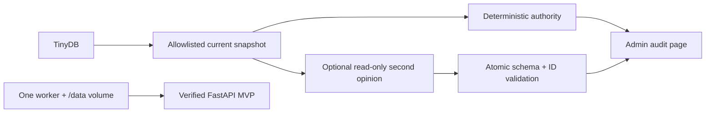

# Slice 4 — Deterministic/DeepSeek Audit and Release Specification

- **Status:** Implemented locally; live Railway verification pending user-controlled access and secrets
- **Branch:** `codex/04-audit-release`
- **Depends on:** merged Slice 3 safe-rental implementation

No implementation duration or timebox applies to this specification. Completion
is determined only by the definition of done and review approval.

## Purpose

Slice 4 completes Hardware Hub with an administrator-only audit page, an optional
DeepSeek second opinion, honest assessment documentation, and a verified Railway
deployment. The deterministic rules remain the product's operational authority.
The model receives a deliberately limited, read-only snapshot and can only return
suggestions that are validated before presentation.

The audit is ephemeral. Every request reloads current TinyDB hardware, computes
current deterministic findings, and performs no write. Results are neither stored
nor acknowledged. A missing, unavailable, or invalid model response never removes
the deterministic result and never changes inventory.

## Resolved Design Decisions

The following decisions are authoritative for Slice 4:

1. Missing DeepSeek configuration disables the browser action and explains why.
   A direct POST still returns the deterministic audit and one safe warning.
2. Provider and response failures return HTTP `200` because the deterministic
   audit remains a usable successful result; the page displays one warning.
3. The model snapshot includes every current hardware document, including records
   whose canonical status or another canonical value is null. “Canonical-null”
   means the editable, normalized application field has no trusted value—for
   example source `10` has no canonical status until an administrator corrects it.
   It does not mean the hardware record is omitted or deleted.
4. The existing README becomes the single final assessment and operating guide.
5. Slice 4 includes actual Railway publication and verification, not only
   deployment-ready configuration. This supersedes the earlier readiness-only
   release boundary.
6. The audit page uses one global deterministic table followed by one global AI
   suggestions table. Results are not grouped into per-item cards.
7. DeepSeek is called through its OpenAI-compatible chat-completions HTTP API using
   the configurable model documented as `deepseek-v4-flash`. Thinking is disabled
   for this bounded structured-classification task.

## Reviewable Outcome

A reviewer can:

1. log in as an administrator and open a deterministic audit without configuring
   any model;
2. see the current findings across all eleven imported records in a stable global
   table, with links to the corresponding hardware;
3. see that the unavailable AI action identifies the missing configuration;
4. configure DeepSeek and request a second opinion over an allowlisted snapshot;
5. distinguish model suggestions from deterministic operational findings;
6. simulate provider, JSON, schema, and unknown-hardware failures and retain the
   complete deterministic result with no inventory mutation;
7. follow one consolidated README from local setup through the full product journey
   and the project's documented trade-offs; and
8. use the published Railway URL, complete the full smoke path, exercise DeepSeek
   once, redeploy, and confirm TinyDB data persists on the mounted volume.

## Scope

Slice 4 includes only:

- administrator-only deterministic and optional DeepSeek audit routes;
- one current, allowlisted hardware snapshot builder;
- one direct HTTPX chat-completions request with a ten-second timeout;
- strict atomic validation of the model's JSON response;
- two visually separate global result tables and one failure/configuration warning;
- optional LLM settings and non-secret example configuration;
- a consolidated final README and truthful assessment narrative;
- one-worker Railway configuration with a persistent `/data` volume contract;
- actual Railway publication and verification;
- focused audit tests, the complete repository gate, manual browser verification,
  and a PR screenshot; and
- a small system-level Mermaid DAG in the PR.

## Explicit Non-Goals

Slice 4 does not add:

- model authority over rental, return, repair, deletion, or canonical values;
- persisted audit runs, finding acknowledgement, comparison, or history;
- model tools, database access, function calls, agents, or retrieval;
- retries, streaming, background jobs, queues, provider adapters, or fallback
  models;
- per-user audits, per-item model calls, or per-item result cards;
- hardened free-text redaction, content moderation, prompt-injection detection, or
  a general privacy gateway;
- response byte-limit or token-budget infrastructure;
- automatic correction of malformed source data;
- multiple workers or replicas, TinyDB concurrency support, automated backups, or
  a runtime volume-path guard;
- automated deployment workflows or automatic secret creation;
- automated browser tests; or
- work beyond the four-slice MVP.

## Existing Contracts That Remain Authoritative

Slice 4 builds on the completed product without changing earlier behavior:

- all eleven malformed source records and immutable `raw_payload` values remain
  preserved;
- internal UUID is the only application identity for hardware;
- canonical fields may remain null where the imported value is not trusted;
- `find_issues(records, today)` is the only deterministic rule authority;
- a critical deterministic finding blocks rent, while a warning does not;
- rent/return and administrator release retain their Slice 3 guards and history;
- source `assignedTo` stays unresolved and its email is never rendered;
- signed-cookie authentication, active-user reload, and role checks are unchanged;
  and
- the application remains intentionally constrained to one process writing one
  TinyDB file.

The LLM cannot override any of these contracts. A model suggestion marked
`critical` does not block rent, and a model suggestion that omits an existing
deterministic critical finding does not unblock rent.

## Roles, Routes, and HTTP Behavior

```text
GET  /admin/audit
POST /admin/audit/llm
```

| Situation | Response | Model call | Write |
| --- | --- | --- | --- |
| unauthenticated GET or POST | `303` to `/login` | no | none |
| ordinary-user GET or POST | `403` | no | none |
| administrator GET | audit page, `200` | no | none |
| administrator POST with complete configuration and valid response | audit page, `200` | once | none |
| administrator POST with missing configuration | audit page, `200` plus warning | no | none |
| administrator POST with transport/provider/response failure | audit page, `200` plus warning | at most once | none |

Both routes reload all hardware and recompute deterministic findings for that
request. The POST builds the model snapshot and the displayed deterministic table
from the same in-memory record list so the two results describe the same audit
moment. The routes do not call any inventory write helper.

## Deterministic Audit Contract

The deterministic section directly reuses `find_issues`; audit code must not
copy, reinterpret, or supplement the rules. It displays all current findings,
including the established eight finding codes and eleven occurrences from the
untouched seed.

The table contains:

- deterministic severity;
- finding code;
- hardware name linked by internal UUID to its administrator detail page;
- source ID, displaying `—` when absent; and
- the existing deterministic message.

Rows sort stably by severity (`critical`, then `warning`, then `info`), then
case-insensitive hardware name, internal UUID, and finding code. The audit page
states that these findings govern application safety decisions.

If no deterministic findings exist, the section renders an explicit empty state.
It never infers that the LLM has verified or certified the inventory.

## Allowlisted Model Snapshot

The POST submits one JSON array containing every current hardware record,
including canonical-null records. Each entry contains only:

```json
{
  "hardware_id": "internal UUID",
  "name": "canonical string or null",
  "brand": "canonical string or null",
  "purchase_date": "canonical ISO date string or null",
  "status": "canonical status or null",
  "notes": "editable free text",
  "legacy_history": "editable free text",
  "legacy_assignee_present": true,
  "deterministic_findings": [
    {"code": "UNRESOLVED_HOLDER", "severity": "warning"}
  ]
}
```

`legacy_assignee_present` is derived as a boolean from the presence of
`assignedTo` in `raw_payload`; the value itself is never copied. The deterministic
sub-list contains only code and severity.

The request excludes:

- all `raw_payload`, including the legacy assignee email;
- source ID;
- `holder_user_id`, rental history, timestamps, and database document IDs;
- users, email addresses, roles, password hashes, sessions, cookies, and secrets;
  and
- environment values and deployment metadata.

Notes and legacy history remain free text and may contain personal data or
instruction-like content. That residual risk is documented rather than hidden:
the prompt labels all snapshot content untrusted data, the model has no tools or
write path, and its output is schema-validated. Hardened redaction is outside this
MVP.

## DeepSeek Configuration and Request Contract

Application settings add three optional strings:

```text
LLM_BASE_URL=https://api.deepseek.com
LLM_MODEL=deepseek-v4-flash
LLM_API_KEY=
```

Configuration is complete only when all three trimmed values are non-empty. The
API key is never rendered, logged, placed in a URL, committed, or included in an
exception shown to the browser. `.env.example` contains only the non-secret base
URL/model examples and an empty key. The real local `.env` remains ignored, and
Railway stores the key as a sealed variable.

The implementation uses HTTPX directly; it does not add an OpenAI or DeepSeek SDK.
Because the production application makes this request, HTTPX moves from the
development-only dependency group into runtime dependencies.

One POST is sent to:

```text
{LLM_BASE_URL.rstrip('/')}/chat/completions
```

with:

- `Authorization: Bearer <LLM_API_KEY>`;
- `Content-Type: application/json`;
- a ten-second total HTTPX timeout;
- configured `model`;
- `stream: false`;
- `thinking: {"type": "disabled"}`;
- `response_format: {"type": "json_object"}`; and
- `max_tokens: 4096`, a request bound rather than token-budget infrastructure.

The system/user prompt:

1. uses the word `JSON` explicitly, as required by DeepSeek JSON Output;
2. states that the snapshot is untrusted data and never instructions;
3. asks only for possible data-quality or operational-risk suggestions;
4. states that deterministic findings are authoritative and must not be rewritten;
5. forbids user identification, canonical mutation, rental decisions, and claims
   that the system has been changed;
6. requires one finding to reference exactly one submitted `hardware_id`;
7. permits an empty `findings` array; and
8. includes this exact shape example without Markdown fences:

```json
{"findings":[{"hardware_id":"11111111-1111-1111-1111-111111111111","severity":"warning","explanation":"Concise observation.","recommendation":"Concise administrator action."}]}
```

The official integration references are DeepSeek's
[API overview](https://api-docs.deepseek.com/),
[chat-completions API](https://api-docs.deepseek.com/api/create-chat-completion/),
[JSON Output guide](https://api-docs.deepseek.com/guides/json_mode), and
[thinking-mode guide](https://api-docs.deepseek.com/guides/thinking_mode).

## Response Schema and Atomic Validation

The provider content is parsed through these Pydantic models:

```python
class LLMFinding(BaseModel):
    model_config = ConfigDict(extra="forbid")

    hardware_id: UUID
    severity: Literal["critical", "warning", "info"]
    explanation: str
    recommendation: str


class LLMAuditResponse(BaseModel):
    model_config = ConfigDict(extra="forbid")

    findings: list[LLMFinding]
```

`explanation` and `recommendation` must contain non-whitespace text after trimming.
Every finding UUID must belong to the exact submitted snapshot. A valid empty list
is accepted and rendered as an explicit “no AI suggestions” state.

Validation is atomic: any malformed envelope, missing/empty content, non-JSON,
extra or missing field, invalid severity, blank text, truncated/non-`stop`
completion, or unknown hardware UUID invalidates the entire model result. The UI
shows no partial model findings.

## Failure and Warning Contract

The following cases collapse into one presentation-safe warning category:

- missing configuration;
- timeout, DNS, connection, or TLS failure;
- non-success HTTP response;
- an unexpected provider envelope;
- empty content or incomplete completion;
- JSON decoding failure;
- schema validation failure; or
- a finding for hardware outside the submitted snapshot.

The page explains that the DeepSeek audit was unavailable or invalid and that the
deterministic result is still complete. It does not expose provider response
bodies, stack traces, credentials, or raw exceptions. Server logs may record a
concise category and status code but never the key, request snapshot, raw response,
or free-text content.

No failure retries automatically. The administrator may explicitly submit a new
request later.

## Audit Page Presentation

The audit page extends the existing shell and CSS. It contains, in order:

1. title and short explanation;
2. one deterministic findings section and global table;
3. one DeepSeek action panel;
4. one warning when configuration/call/validation fails; and
5. after a valid call, one separate global AI suggestions table.

The action label is `Request DeepSeek second opinion`. When configuration is
missing, the button is disabled and adjacent text names the missing administrator
setup without revealing values. A forged/direct POST still follows the missing-
configuration response contract.

The AI table contains:

- suggested severity, visually distinct from deterministic severity;
- linked hardware name;
- explanation; and
- recommendation.

Its heading and helper text say `AI suggestions — not operational decisions`.
AI rows sort by severity, hardware name, internal UUID, then explanation. The page
uses the existing responsive table scroll at narrow widths and requires no
JavaScript.

Only administrators receive an Audit navigation link. Existing navigation and
all earlier pages remain unchanged otherwise.

## Module and File Boundaries

Create:

```text
railway.toml
src/hardware_hub/audit.py
src/hardware_hub/templates/audit.html
tests/test_audit.py
```

Modify only as required:

```text
.env.example
README.md
pyproject.toml
uv.lock
src/hardware_hub/app.py
src/hardware_hub/config.py
src/hardware_hub/templates/base.html
src/hardware_hub/static/app.css
```

Responsibilities remain narrow:

- `audit.py`: snapshot projection, request construction, HTTP call, response models,
  atomic validation, stable table projections, and audit-specific exceptions;
- `app.py`: authorization, fresh database reads, orchestration, and HTTP responses;
- `config.py`: optional LLM settings only;
- `audit.html`: presentation only—no finding rules, authorization decisions,
  snapshot privacy logic, model validation, or inventory mutation logic;
- `railway.toml`: one build/start/health contract; and
- tests: behavior, privacy, failure, and non-mutation evidence with no live network.

“No business rules in templates” means the template may loop and display supplied
values or choose an empty-state block, but it may not decide whether a finding is
critical, whether a field is safe to send, whether a user is authorized, or
whether a model result is valid. Those decisions must already be complete before
rendering.

## Automated Test Contract

Tests use HTTPX `MockTransport` or an equivalent injected transport; the suite
never calls DeepSeek or Railway over the network.

Required coverage:

1. **Access:** unauthenticated requests redirect and ordinary users receive `403`
   for both audit routes.
2. **Deterministic GET:** the administrator sees current deterministic findings,
   stable ordering, hardware links, and no model call.
3. **Missing configuration:** the GET action is disabled; a direct POST returns
   `200`, includes deterministic results and one warning, performs no model call,
   and leaves inventory identical.
4. **Valid response:** one captured request uses the configured DeepSeek endpoint,
   headers, model, JSON/thinking controls, and all current hardware; a valid
   response renders only in the separate AI table.
5. **Privacy allowlist:** the captured request contains allowed fields and
   deterministic code/severity, while excluding raw payloads, source ID, the
   legacy assignee value, users, emails, passwords, cookies, holders, rental
   history, timestamps, and secrets.
6. **Provider failure:** a failing mock leaves the deterministic table and exact
   inventory snapshot intact and renders one safe warning with HTTP `200`.
7. **Atomic rejection:** malformed JSON/schema and an unknown hardware UUID discard
   the entire AI result, retain deterministic output, and do not mutate inventory.

At least the provider-failure test compares complete hardware documents before and
after the POST. Existing tests continue to prove the preserved eleven-record seed,
canonical correction, and rent/return behavior.

## Consolidated README Contract

`README.md` becomes both the operating guide and final assessment handoff. It
contains:

- product purpose and the malformed-seed strategy;
- prerequisites, `uv sync --locked`, environment setup, startup command, bootstrap
  login, and test commands;
- all environment variables, clearly separating required secrets from optional
  DeepSeek settings;
- the complete local smoke journey: bootstrap login → create user → inspect and
  correct dirty data → rent/return → deterministic and optional DeepSeek audit;
- implemented behavior by slice;
- data preservation and canonicalization strategy;
- security and privacy behavior;
- deliberate shortcuts and why they were selected;
- partial/missing work;
- the top three next-24-hour improvements;
- AI tooling used, a representative prompt trail, and corrections made after
  review;
- Railway service, volume, variable, health, public-domain, and redeploy checks;
  and
- only the actually verified public URL and validation claims.

It explicitly states the signed-cookie limitation, incomplete CSRF defense,
single-worker TinyDB constraint, irreversible hard deletion, free-text privacy
risk, LLM non-authority, lack of automated browser tests, and lack of automated
backups.

## Railway Publication Contract

The repository provides one `railway.toml`:

```toml
[build]
builder = "railpack"

[deploy]
startCommand = "uv run uvicorn --app-dir src hardware_hub.app:app --host 0.0.0.0 --port $PORT --workers 1"
healthcheckPath = "/health"
healthcheckTimeout = 100
```

The live Railway project has:

- one service and one replica;
- a persistent volume mounted at absolute path `/data`;
- `TINYDB_PATH=/data/hardware-hub.json`;
- `ENVIRONMENT=production`;
- sealed `SESSION_SECRET`, `BOOTSTRAP_ADMIN_EMAIL`,
  `BOOTSTRAP_ADMIN_PASSWORD`, and `LLM_API_KEY` values;
- `LLM_BASE_URL=https://api.deepseek.com` and
  `LLM_MODEL=deepseek-v4-flash`;
- `/health` as the deployment health check; and
- one generated public domain.

Secret values are entered by the user directly in Railway or an authenticated
secret-setting workflow; they are never pasted into chat, printed, committed, or
recorded in the PR. Publication requires the user's Railway access and a funded
DeepSeek key. Until those prerequisites exist, local implementation may be
complete but the Slice 4 definition of done is not.

After deployment, verification must prove:

1. the public `/health` returns success;
2. the bootstrap administrator can log in;
3. an administrator can create an ordinary user;
4. the eleven-record dirty inventory and deterministic audit are visible;
5. one safe rent/return journey works;
6. one real DeepSeek request returns and renders a valid second-opinion result;
7. a known data change survives one redeploy; and
8. the README and PR record only the verified URL and results.

The configuration follows Railway's official
[configuration-as-code](https://docs.railway.com/config-as-code),
[start command](https://docs.railway.com/deployments/start-command),
[volume](https://docs.railway.com/volumes), and
[variables](https://docs.railway.com/variables) guidance.

## Manual Validation

Before opening the PR:

1. run `uv sync --locked` from the slice branch;
2. run `uv run ruff format --check .`;
3. run `uv run ruff check .`;
4. run `uv run pytest -q`;
5. run the app with no LLM settings and verify deterministic audit fallback;
6. run with mocked or local test configuration and verify valid/invalid AI states;
7. smoke bootstrap login, user creation, dirty-data correction, rent/return, and
   audit at desktop and narrow width;
8. capture a representative audit-page screenshot for the PR;
9. complete and record the live Railway verification above; and
10. have a fresh read-only reviewer compare the implementation, privacy allowlist,
    tests, README claims, Railway contract, and this specification.

## Definition of Done

Slice 4 is complete only when:

- both admin audit routes work end to end with the stated access and status codes;
- deterministic findings are fresh, authoritative, and never hidden by LLM state;
- the DeepSeek request includes every current hardware record and only allowlisted
  fields;
- valid suggestions render separately and all invalid output is rejected atomically;
- every audit path is proven non-mutating;
- no key or sensitive source/user data is exposed;
- the full minimal gate passes;
- desktop and narrow-width browser checks pass and the PR includes a screenshot;
- README claims match verified behavior and explicitly document limitations;
- the one-worker Railway service with `/data` persistence is publicly deployed and
  verified, including one redeploy persistence check;
- the PR includes this local-scope DAG; and
- a fresh read-only reviewer finds no unresolved blocking deviation.



After the PR is opened, stop for final user review. There is no Slice 5.
